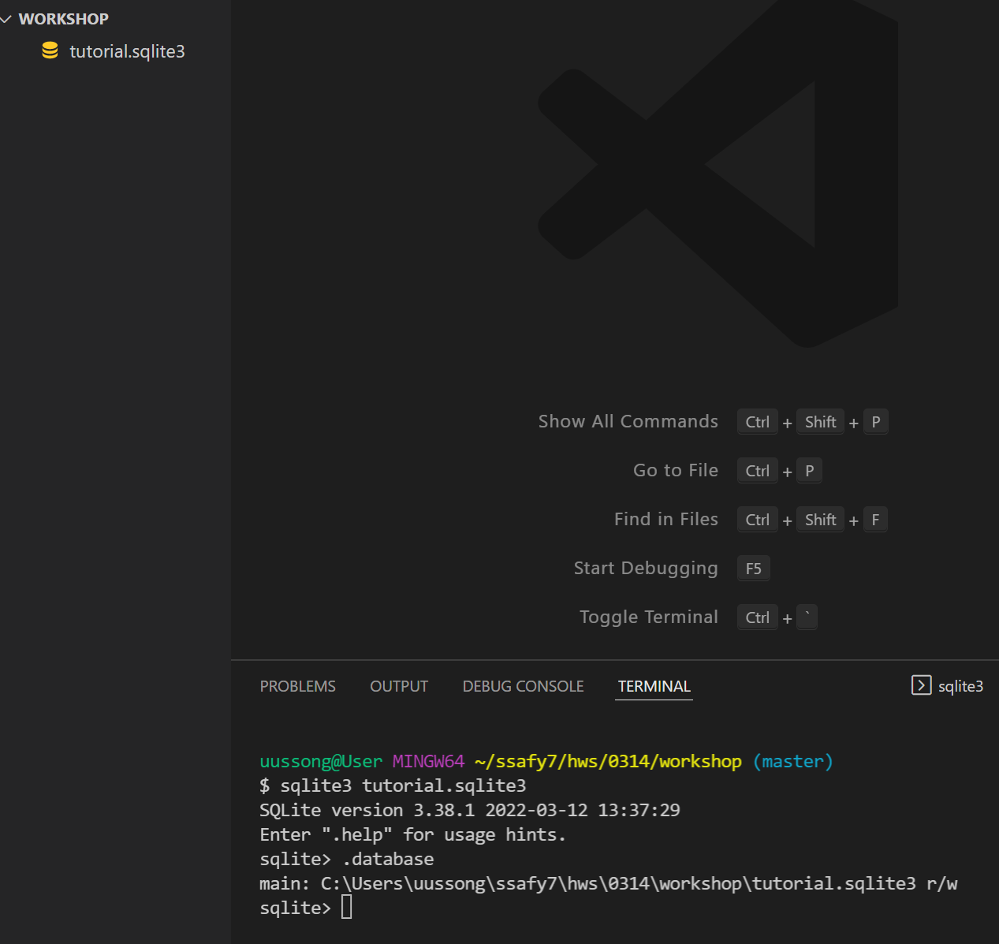
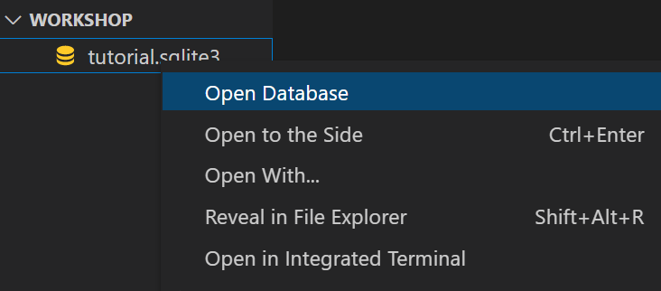
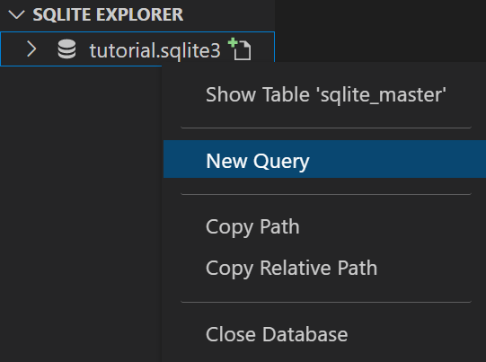
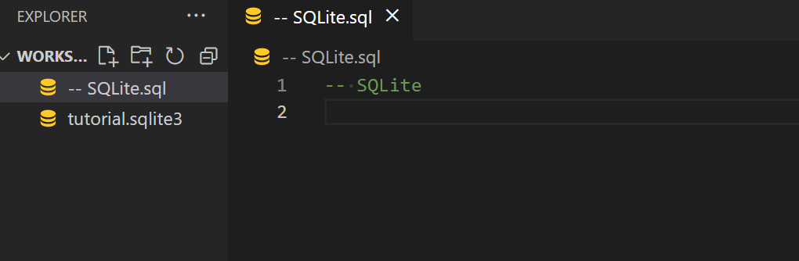
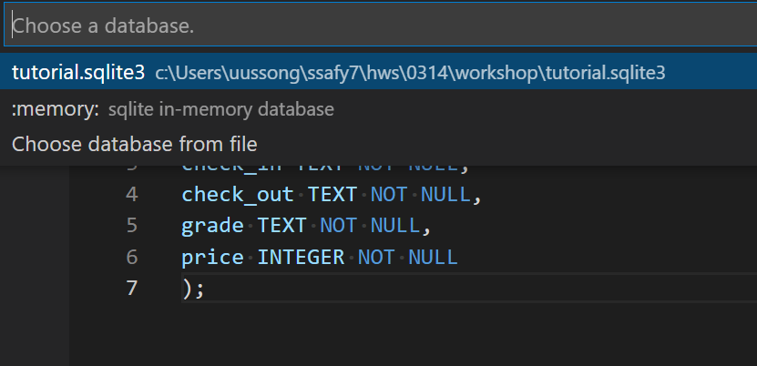

# DB

- 데이터와 자료가 조직적으로 구조화되어있는 집합체

## RDB

- 관계형 데이터베이스(Relational Database)
- 키와 값들의 간단한 관계를 표 형태로 정리한 데이터베이스

- 스키마
  - 명세를 기술 
  - cloumn에 대한 이름 정보 / coloumn이 가지는 각각의 데이터 타입
- 테이블
  - 열(컬럼/필드)과 행(레코드/값) 모델을 사용한 조직된 데이터 요소들의 집합
- 열
  - 각 열에는 고유한 데이터 형식이 지정됨
  - 열 = 컬럼 = 필드
- 행
  - 실제 데이터가 저장되는 형태
  - 행 = 로우 = 레코드
- 기본키(PK)
  - 각 행의 고유값
  - 데이터 베이스 관리 및 관계 설정 시 주요하게 활용

## RDBMS

- 관계형 데이터베이스 관리 시스템(Relational Database Managgement System)
- 관계형 모델을 기반으로 하는 데이터베이스 관리시스템을 의미
  - MySQL, ORACLE, SQLite 등

### SQLite

- 파일 형태로 응용 프로그램에 넣어서 사용하는 비교적 가벼운 데이터베이스, 조작 쉬움


## SQL

- Structured Query Language
- RDBMS의 데이터 관리를 위해 설계된 특수 목적의 프로그래밍 언어
- 데이터베이스 스키마 생성 및 수정
- 데이터베이스 객체 접근 조정 관리
- SQL 분류
  - 데이터 정의 언어 DDL(Data Definition Language)
    - 테이블, 스키마를 정의하기 위한 명령어
    - CREATE, DROP, ALTER
  - 데이터 조작 언어 DML(Data Manipulation Language)
    - 데이터 저장, 조회, 수정, 삭제(CRUD)하기 위한 명령어
    - INSERT, SELECT, UPDATE, DELETE
  - 데이터 제어 언어 DCL(Data Control Language)
    - 내부적으로 권한을 제어하기 위한 명령어
    - GRANT, REVOKE, COMMIT, ROLLBACK


## 테이블 생성 및 삭제

- 데이터베이스 생성하기
  - `sqlite3 tutorial.sqlite3`
  - `sqlite> .database`

- 데이터베이스 생성

  

- Open Database 클릭

  

- New Query 클릭

  

- 새로 생성된 .sql 파일에서 작업

  

- run selected query 선택 후 맨 처음엔 생성한 database 선택

  

- csv 파일을 table로 만들기

  ```sqlit
  sqlite> .mode csv
  sqlite> .import hellodb.csv examples
  sqlite> .tables
  examples
  ```

