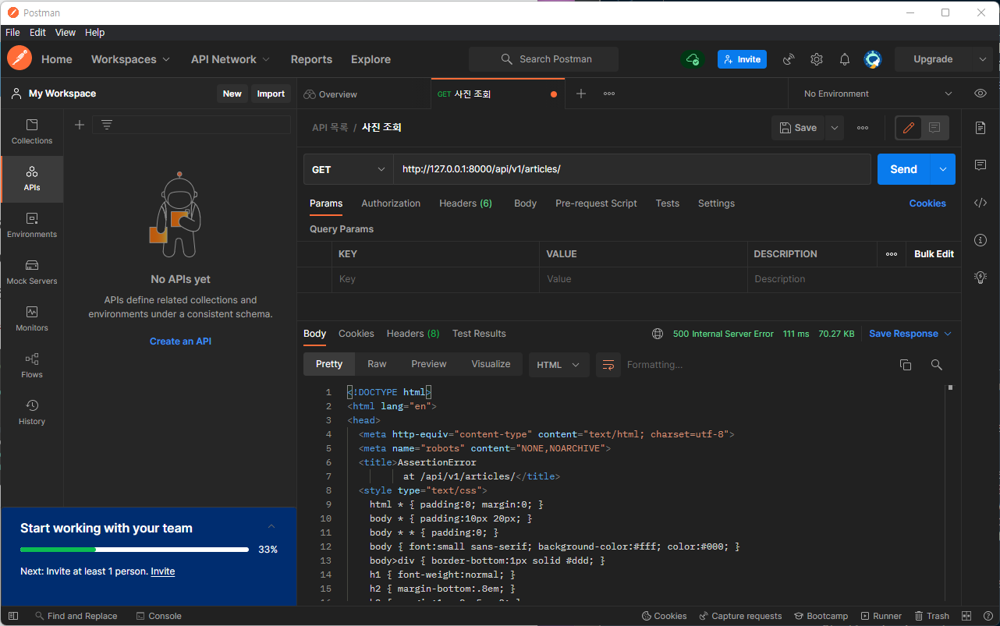
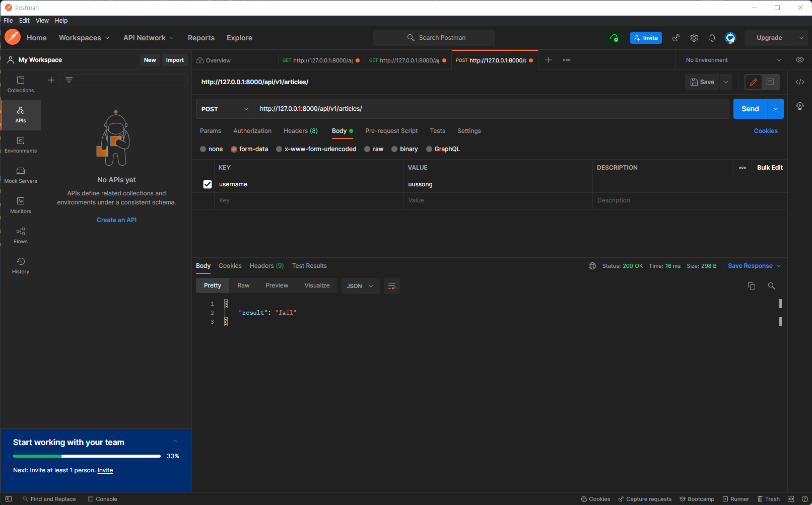
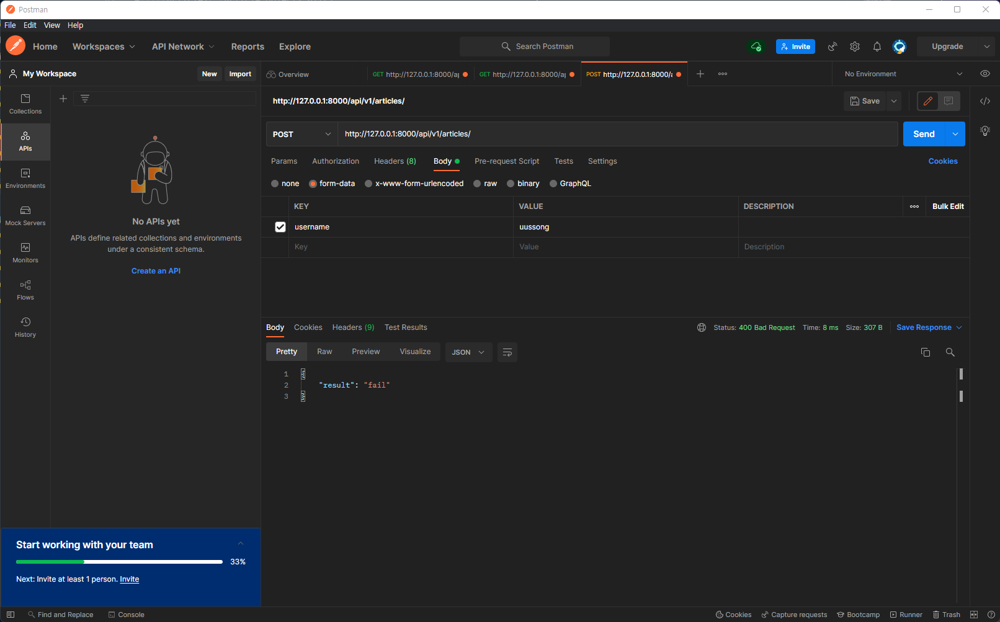
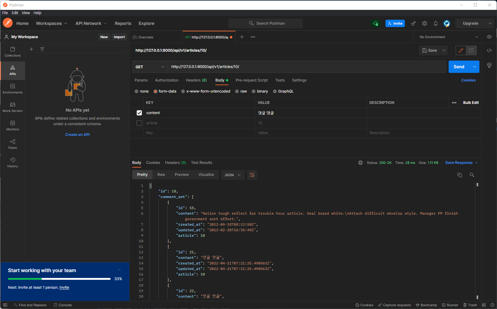

# REST API

## HTTP

- HyperText Transfer Protocol
- 클라이언트와 서버가 서로 어떤 형식으로 데이터를 보내줄 건지를 약속한 것 (규약)
- HTTP말고도 다른 프로토콜도 있음 
  - FTP, SSH, TELNET, SMTP, HTTP, HTTPS(secure 조금 더 안전한 HTTP) 등
- 클라이언트와 서버가 서로 데이터를 주고 받으려면 프로토콜이 필요 
- 웹 개발에서는 HTTP, HTTPS가 중요
- HTTP의 기본 특성
  - 비연결성(Connectless)
    - 클라이언트와 서버가 한 번 응답을 주고 받으면, 연결을 끊는다.
    - 왜 이렇게 설계?
      - 서버는 한 대 내지 두 대 클라리언트는 수 만 대 요청 할 때 마다 계속 연결성을 갖고 있어야 한다면 엄청난 네트워크 리소스가 필요할 것, 이를 아끼기 위해서
  - 무상태(Stateless)
    - Connectless 때문에 발생한 것, 계속해서 요청을 끊어버리기 때문에 서버가 클라이언트를 기억하지 못 함(식별 불가능)
      - 매번 요청할 때마다 내가 누군지를 서버에게 알려줘야함
- 쿠키와 세션을 통해 서버 상태를 요청과 연결하도록 함
  - 쿠키
    - 클라이언트가 기억해서 서버로 들고감
    - 보안이 취약하다는 문제점
  - 세션 
    - 민감한 정보를 서버가 기억 
    - 쿠키에는 세션의 id만 담음 이를 확인해 연결

### HTTP request methods

- 우리가 어딘가 요청을 보냈을 때 결국 원하는 동작이 무엇이냐
- 클라이언트가 서버에게 request를 보내면 이러한 리퀘스트가 어떤 리퀘스트인지 서버가 쉽게 알려주기위해, 표현하기 위해 만들어짐
- 같은 주소로 요청을 보내더라도 메서드에 따라 우리가 원하는 행동이 달라짐
  - GET 조회 POST 작성, 수정, 삭제
    - POST 요청 나눌 것! -> POST 작성 PUT 수정 DELETE 삭제 
  - HTTP Method만 보고 CRUD를 판단할 수 있게 됨
  - RESTful API와 연결
    - url에는 뭘 하겠다는 액션이 없음 그저 자원을 표현하는 단계
    - post/1/을 GET / POST 할 때 동작이 달라질 것

### HTTP response status codes

- 특정 HTTP 요청이 성공적으로 완료되었는지 여부를 나타냄
- 회사 내부적으로 백엔드 개발자와 클라이언트 개발자가 약속하는 것
- 응답은 5개의 그룹으로 나누어짐 (2, 4, 5알아둘 것) [공식문서](https://developer.mozilla.org/ko/docs/Web/HTTP/Status)
  - Infomational responses (1xx)
    - 일반적인 기업에서 많이 쓰지 않음
    - 서버가 클라이언트한테 정보성 응답
    - 100 Continue 클라이언트가 서버한테 계속 요청해도 괜찮겠니? 해서 100 내려주면 계속해도 된다는 의미에 정보성 상태코드
  - Successful responses (2xx)
    - 일반적인, 정상적인 상황
    - 200 OK 요청한 게 뭐든지 간에(GET,POST,PUT 등 뭘 보내던) 정상적으로 처리
    - 201 Created 클라이언트에 요청대로 리소스가 잘 생성됨
  - Redirection responses (3xx)
    - 클라이언트가 요청을 했는데 서버 입장에서 그 요청을 처리하려면 조금 더 추가적인 작업이 필요하다는 의미가 담긴 상태코드
    - 301 Moved Permanently 영구적으로 옮겨짐, 요청한 리소스 그 위치에 있지 않음 보통 301 준다음 서버가 redirect함
    - 304 Not Modified 수정되지 않았음 
      - 우리가 사용하는 크롬브라우저는 이미지 같은 리소스를 이전에 한 번 서버로부터 받으면 잘 가지고 있음 그러다 다시 그 페이지 방문하면 또 다시 그 이미지를 서버에 달라고 할 텐데 이 때 서버가 이전에 그 이미지 가지고 있다고 하고 브라우저는 그 이미지를 꺼내 화면을 그려줌 
      - 이런 방식으로 네트워크 자원이 절약되고 이미지를 빨리 보게됨 = 브라우저 캐싱
  - Client error responses (4xx)
    - 웹 브라우저에서 문제 발생, 클라이언트 에러
    - 400 Bad Request 클라이언트가 요청은 제대로 했는데 형식이 안 맞거나 문법이 잘 못 됨 
      - 꼭 필요한 정보를 안 줬거나 형식이 틀렸거나한 경우
    - 401 Unauthorized 인증 관련, 요청을 수행하기 위해선 인증부터 필요하다고 막는 것
    - 403 Forbidden 권한 관련, 인증은 잘 해왔는데 권한이 막힘
    - 404 Not Found 서버한테 아예 없는 리소스를 요청
      - url 잘 못 입력했거나 요청을 잘 못 한 경우
    - 429 Too Many Requests 짧은 시간안에 너무 많은 요청을 보냈을 때 서버가 판단해서 429 보냄
  - Server error responses (5xx)
    - 백엔드에서 문제 발생 
    - 500 Internal Server Error 클라이언트 요청은 너무 올바른데 서버 내부 에러로 인해 그 요청을 처리할 수 없음
    - 503 Service Unavailable 갑자기 너무 많은 요청이 들어와서 서버가 폭주가 되거나(트래픽 폭주) 점검중이라 일시적으로 서비스를 제공할 수 없는 상태 

### 웹에서의 리소스 식별

- 리소스(resource, 자원): HTTP 요청의 대상
  - 서버에 존재하는 정보 / 자원 / 데이터
  - 문서, 사진 또는 기타 어떤 것이든 될 수 있음

- 데이터CRUD는 리소스를 조회 추가 갱신 삭제 했다고 말할 수 있음
- 각 리소스는 리소스 식별을 위해 HTTP 전체에서 사용되는 URI로 식별됨

### URL, URN

- 인터넷 상에서 정보를 어떻게 표현할 것인가.
- URL(Uniform Resource Locator)
  - 가장 일반적으로 사용
- URN(Uniform Resource Name)
  - URL과 달리 자원의 위치에 영향을 받지 않는 유일한/고유한 이름 역할

### URI

- Uniform Resource Identifier
- 인터넷의 자원을 식별하는 유일한 주소(정보의 자원을 표현)
- 하위 개념이 URL, URN
- URN을 사용하는 비중이 매우 적기 때문에 일반적으로 URL은 URI와 같은 의미 처럼 사용
- **구조**
  - Scheme(protocol) 
    - http(s)
  - Host (Domain name)
    - 요청 받는 웹 서버 이름
    - IP address를 사람이 사용하기엔 부적합해 주소로 갈 수 있는 이름을 붙여놓는 것
    - 배포할 때 나만의 도메인 주소를 구매하기도 함
  - Port
    - 웹 서버 상의 리소스에 접근하는데 사용되는 기술적인 문
    - 일반적으로 출력되지 않으며 로컬 서버에서 진행될 때 로컬 서버가 출력됨
    - HTTP 프로토콜의 표준 포트
      - HTTP 80 HTTPS 443
  - Path
    - 웹 서버 상의 자원의 경로
    - 실제 위치가 아닌 추상적인 형태로 표현됨
  - Query (Identifier)
    - Query String Parameters
    - 웹 서버에 제공되는 추가적인 매개 변수
    - &로 구분되는 key-value 목록
      - GET요청 시 확인 가능
      - 웹 서버에 검색할 경우 확인 가능
  - Frangment
    - #뒤로 오는 부분
    - 특정 자원 안에서의 북마크 역할
    - HTML안의 특정 지점을 공유할 때 나타남
    - #뒤의 부분 요청은 서버에 보내지지 않으며 Fragment를 해석하는 것은 브라우저임


## RESTful API

### API

- Application Programming Interface
- 애플리케이션과 프로그래밍으로 소통하는 방법
  - CLI 명령어, GUI 그래픽(아이콘) 클릭, API 프로그래밍 요청을 통해
- 어떤 서비스를 이용하기 위해 데이터를 어떻게 요청하고 어떤 데이터를 내려줄 지 짜는 것
- 응답 데이터 타입 
  - JSON (HTML, XML)
- Web API
  - (장고처럼)웹 애플리케이션 개발에서 다른 서비스에 요청을 보내고 응답을 받기 위해 정의된 명세
  - Open API 활용 -> 거의 모든 사이트에서 제공
    - Youtube, 카카오톡, 네이버 웹툰, 디스코드, TMDB 등

### REST

- REpresentational State Transfer
- API 서버를 개발하기 위한 일종의 소프트웨어 설계 방법론
  - 규약, 약속이 아님 반드시 이런 방식으로 설계해야 하는 것 아님 다양한 방법론 중 하나
- 네트워크 구조를 설정하는 원리를 정리한 것
  - 넷 상에서 자원을 정의하고 자원에 대한 주소를 지정하는 전반적인 방법
  - URI를 어떤 구조로 정리할 것인가
- REST 원리를 따르는 시스템을 RESTful 이란 용어로 지칭
- 자원을 정의하는 방법에 대한 고민
- REST 자원과 주소의 지정 방법
  - 자원: URI
  - 행위: HTTP Method
  - 표현 
    - 자원과 행위를 통해 궁극적으로 표현되는 결과물(데이터)
    - JSON으로 표현된 데이터 제공
- REST의 핵심 규칙
  - '정보'는 URI로 표현
  - 자원에 대한 '행위'는 HTTP Method로 표현 (R: GET, C: POST, U: PUT, D: DELETE)
- 설계 방법론을 지키지 않더라도 동작 여부에 영향을 미치지 않으나 실제 개발 환경에서 모두 사용하므로 지켜야만 함

### JSON

- JavaScript Object Notation
- 가벼운 데이터 통신 포맷
- JavaScript의 객체 표기법을 따르는 단순 문자열
- 사람이 읽거나 쓰기 쉽고 기계가 파싱(해석, 분석)하고 만들어내기 쉬움
- key-value의 데이터 쌍이 여러 개 있는 구조 
  - 프로그래밍 언어에서 기본적으로 지원하는 구조

### RESTful API

- REST 원리에 따라 설계한 API
- REST API와 같은 말
- 프로그램을 통해 해당되는 클라이언트에 대한 요청에 JSON을 응답하는 서버를 구성
- 오늘 사용하는 장고 서버가 REST API 서버가 되는 것
- REST API를 사용하는 서비스를 RESTful 서비스라고 함

#### RESTful 하게 짜는 법

- URL은 리소스를 나타내기 위해서만 사용하고, 리소스에 대한 처리는 메서드로 표현
- Document는 단수명사로, Collection은 복수명사로 표현 (URL 네이밍 관련)
  - Document가 모여서 있는게 Collection
    - 각각의 article이 Document / article 모여있는 게 Collection
    - `~/articles/1` s를 항상 붙여줘야함 articles은 Collection, 1이 Document
    - 여러 개 article이 모여있는 Collection에 POST 요청을 보내면 article 생성
- 꼭 JSON을 쓰는 건 아니지만 오늘날 보통 JSON 사용


## Single Model

### DRF with Single Model

- Django REST framework 라이브러리를 이용한 JSON응답
- `pip install djangorestframework`

```python
# settings.py

INSTALLED_APPS = [
    'articles',  # 앱 이름
    'django_seed',
    'rest_framework',
    ...
]
```

- settings.py에 `INSTALLED_APPS`에 적어주어야 함
- 단일 모델의 data를 serialization해 JSON으로 변환하는 방법

####  Serialization

- 직렬화
- 데이터 구조나 객체 상태를 동일하거나 다른 컴퓨터 환경에 저장하고, 나중에 재구성할 수 있는 포맷으로 변환하는 과정
- Queryset을 JSON 등 유형으로 쉽게/유연하게 변환할 수 있는 객체로 만들어 주는 것
- Queryset 데이터를 JSON과 같은 다른 데이터로 응답을 해줘야하는데 이를 유연하게 변경할 수 있도록하는 중간 과정의 데이터 타입으로 변경하는 것이 Serialization 과정
- 중간 단계의 모습, 파이썬 데이터 타입을 최종적으로 JSON으로 변환할 것

### Postman

- Postman으로 브라우저 대체해 사용
- API를 구축하고 사용하기 위해 여러 도구를 제공하는 API 플랫폼

### Create Dummy Data

- 모델 구조에 맞는 fake data 생성
- 역시 설치 후 `INSTALLED_APPS`에 `'django_seed'`를 적어줘야 함
- `python manage.py seed <모델명> --number=개수`

### ModelSerializer

- 모델 필드에 해당하는 필드가 있는 Serializer 클래스를 자동으로 만들 수 있는 shortcut
  - 모델폼과 같이 모델에 맞춰서 serialize 컬럼을 조정
  - serializer를 modelform이라 생각하자
- 핵심 기능
  - 모델 정보에 맞춰 자동으로 필드 생성
  - serializer에 대한 유효성 검사기 자동으로 생성
  - `.create()` `.update()` 간단한 기본 구현 표함
- 유저에게 보여주는 정보가 아니기 때문에 어떤 필드 내려줄지는 프론트앤드 개발자와 얘기해 설계하는 것
- 쿼리셋 전체에 대해 시리얼라이징 해주는 모델시리얼라이저를 만들 것
- `serializers.py`를 만들어 작성
  - 꼭 이름이 `serializers.py`일 필요는 없음
  - 갯수가 많아지면 `serializers` 디렉토리를 만들어 그 안에 모델별로 파일을 만들어 관리하게 됨


### GET - Article List

- url에서 app name, url name 불필요 템플릿이 따로 없기 때문
- 전체 게시글 응답을 JSON형태로 나타내는 view함수를 작성해야함

```python
# articles/serializers.py

class ArticleListSerializer(serializers.ModelSerializer):

    class Meta:
        model = Article
        fields = ('id', 'title',)
```

```python
# articles/views.py

@api_view(['GET'])
def article_list(request):
    articles = get_list_or_404(Article)
    serializer = ArticleListSerializer(articles, many=True)
    return Response(serializer.data)
```

- `get_list_or_404` 

  - 조회하고자 없는 쿼리셋이 없으면 404 return 

- `many=True`

  - QuerySet 등 여러 인스턴스를 직렬화 할 때 사용

- `api_view` decorator

  - view 함수가 응답해야 하는 HTTP Method 목록을 리스트 인자로 받음
  - 필수로 작정해야 함 작성하지 않으면 view함수 동작 x

  

  - `api_view` 데코레이터를 붙여주지 않으면 500에러가 뜸

### GET  - Article Detail

- Article List와 Detail 구분
  - 응답 출력에서 두 개의 컬럼만 조회 단일 데이터 조회(detail)에서는 모두 조회하도록 설계
  - 보여지는 정보가 다르니까 serializer class를 따로 만들어야 함

```python
# articles/serializers.py

class ArticleSerializer(serializers.ModelSerializer):

    class Meta:
        model = Article
        fields = '__all__'

```

```python
# articles/views.py

@api_view(['GET'])
def article_detail(request, article_pk):
    articles = get_object_or_404(Article, pk=article_pk)
    serializer = ArticleListSerializer(articles)
    return Response(serializer.data)
```

- `get_object_or_404` 와 `get_list_or_404` 구별
- 하나의 객체를 받아오는 것이므로 many=False(디폴트값)가 됨

### POST - Create Article

- view 함수 article_list에서 게시글 조회, 생성 모두 처리 가능
  - `elif request.method ==''`방식으로 GET, POST 등 [Method 구분]((https://www.django-rest-framework.org/tutorial/2-requests-and-responses/#pulling-it-all-together)) 

```python
# articles/views.py

@api_view(['GET', 'POST'])
def article_list(request):
    if request.method == 'GET':
        articles = get_list_or_404(Article)
        serializer = ArticleListSerializer(articles, many=True)
        return Response(serializer.data)

    elif request.method == 'POST':
        serializer = ArticleSerializer(data=request.data)
        if serializer.is_valid(raise_exception=True):
            serializer.save()
            return Response(serializer.data, status=status.HTTP_201_CREATED)
        # return Response({"result": "fail"}, status=status.HTTP_400_BAD_REQUEST)
```

- Serializer의 첫번째 인자가 인스턴스 두번째가 데이터이기 때문에 데이터만 받을 경우 키워드 인자로 데이터를 넣음

- Status Code in DRF

  

  - `status=status.HTTP_201_CREATED`
  - status code 200이 default 이를 바꿔주기 위해 따로 처리해 주는 것

  - `from rest_framework import status` 모듈안에 속성값들(HTTP status code 집합)이 존재
    - status를 좀 더 명확히 명시적으로 보낼 수 있게 됨
  - 단순히 `status=201` 표현도 가능하지만 권장하지 않음



- HTTP body에 form-data로 데이터 key-value 작성
- `raise_exception`
  - `is_valid(raise_exception=True)`
  - 유효성 검사 오류가 있는 경우 기본적으로 HTTP status code 400을 응답으로 반환
    - 왜 오류가 났는지에 대한 디테일한 정보 또한 제공
  - `return Response({"result": "fail"}, status=status.HTTP_400_BAD_REQUEST)` 과 같이 써줄 필요 없어짐

### DELETE - Delete Article / PUT - Update Article

- view 함수 article_detail에서 게시글 조회, 삭제, 수정 모두 처리 가능 

```python
@api_view(['GET', 'DELETE', 'PUT'])
def article_detail(request, article_pk):
    article = get_object_or_404(Article, pk=article_pk)
    if request.method == 'GET':
        serializer = ArticleSerializer(article)
        return Response(serializer.data)
    
    elif request.method == 'DELETE':
        article.delete()
        return Response({f'{article_pk} deleted'}, status=status.HTTP_204_NO_CONTENT)

    elif request.method == 'PUT':
        serializer = ArticleSerializer(article, data=request.data) #, partial=True)
        if serializer.is_valid(raise_exception=True):
            serializer.save()
            return Response(serializer.data)
```

- Delete
  - `status=status.HTTP_204_NO_CONTENT`
- Update
  - serializer가 인스턴스와 데이터 모두를 인자로 받아옴
  - article object를 request에 있는 데이터로 수정해줌
  - title, content 중 하나만 수정하면 에러
    - [partial=True](https://www.django-rest-framework.org/api-guide/serializers/#partial-updates) 붙이면 해결 가능
    - PUT 전체 다 바꿀 때 쓰는 것 PATCH 부분 수정을 의미 하나 PUT으로 다 써도 무방


## 1:N Relation

### DRF with 1:N Relation

- 2개 이상의 1:N 관계를 맺는 모델을 두고 CRUD 로직을 수행 가능하도록 설계

### POST - Create Comment

```python
# articles/urls.py
urlpatterns = [
    ...
    path('articles/<int:article_pk>/comments/', views.comment_create),
]
```

```python
# articles/views.py

@api_view(['POST'])
def comment_create(request, article_pk):
    article = get_object_or_404(Article, pk=article_pk)
    serializer = CommentSerializer(data=request.data)
    if serializer.is_valid(raise_exception=True):
        serializer.save(article=article)
        return Response(serializer.data, status=status.HTTP_201_CREATE
```

- Comment 생성은 생성 시 참조하는 모델의 객체 정보가 필요

  - 1:N 관계에서 N은 어떤 1을 참조하는지에 대한 정보가 필요하기 때문 (외래 키)

- `.save()`

  - `serializer.save(article=article)`
  - 특정 Serializer 인스턴스를 저장하는 과정에서 저장하는 시점에 추가적인 데이터를 받을 수 있음

- Read Only Field (읽기 전용 필드)

  ```python
  # article/serializers.py
  
  class CommentSerializer(serializers.ModelSerializer):
  
      class Meta:
          model = Comment
          fields = '__all__'
          read_only_fields = ('article',)
  ```

  - 어떤 게시글에 작성하는 댓글인지에 대한 정보를 form-data로 넘겨주지 않았고 null = False이므로 article 필드가 유효성 검사를 통과하지 못함
  - 읽기 전용 필드로 설정해 serialization할 때 유효성 검사(validation: is_valid)에서는 빠지고 serializer.data에서는 읽을 수 있게 데이터를 넣어줄 수 있음
    - article을 form-data로 넘겨주지 않고 content만 보내더라도 유효성 검사를 통과하게 됨

### 1:N Serializer

#### 특정 게시글에 작성된 댓글 목록 출력

- 게시글 조회할 때 (1:N으로 연결된) 댓글 데이터도 출력하고 싶다면 기존 필드를 덮어씌우거나 추가 필드를 구성해야 함

##### `PrimaryKeyRelatedField`

```python
# article/serializers.py

class ArticleSerializer(serializers.ModelSerializer):
    comment_set = serializers.PrimaryKeyRelatedField(many=True, read_only=True)
    
    class Meta:
        model = Article
        fields = '__all__'
```

- Article의 pk를 참조하는 comment를 역참조 하겠다는 것

  - 역참조 매니저를 기존 필드라고 생각

- 1:N 구조에서 N인 comment를 가져오는 것이므로 `many=True` 추가

- `read_only = True`

  - 기존 필드(메타클래스의 fields)에 존재하지 않는 추가로 커스텀한 경우 
  - 메타 클래스의 `read_only_fields`는 모델에 정의된 필드에 대한 것

  

- 클라리언트가 게시글 하나만 조회해도 여기에 달린 댓글 정보도 확인할 수 있게 함
  - pk정보만 뜸

##### Nested relationships

```python
# article/serializers.py

class CommentSerializer(serializers.ModelSerializer):

    class Meta:
        model = Comment
        fields = '__all__'
        read_only_fields = ('article',)
        
class ArticleSerializer(serializers.ModelSerializer):
    comment_set = CommentSerializer(many=True, read_only=True)

    class Meta:
        model = Article
        fields = '__all__'
```

- nested관계는 1:N 구조가 이루어진 상태에서만 가능
- 참조된 대상은 참조하는 대상의 응답에 포함되거나 중첩될 수 있음
  - 참조된 대상 1 참조하는 대상 N
- 호출해야하는 클래스가 위에서 정의되어야함



- 기존 serializer의 필드에서 모두 출력되게 했으므로(`fields = '__all__'`) 모든 정보를 다 볼 수 있음
  - 1에서 N의 목록이 달려나옴

