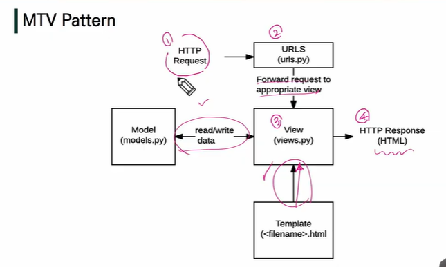

# Django

## Web Framework

- 장고는 파이썬 무료 오픈소스 웹 어플리케이션 프레임워크
  - 웹 어플리케이션은 흔히 보는 서비스로 네이버 등이 있음
  - 이러한 웹 서비스에는 HTML, CSS, JS, DB, 서버, 보안 +@(로그인, 로그아웃, 회원가입, 좋아요 등등)이 필요
  - 웹서비스를 만드는데 공통된 형태로 뽑을 수 있는 것들이 존재

- 이러한 것들의 재사용성을 높이기 위해 보기 좋은 구조로 뭉쳐놓은 것이 프레임워크
  - 프레임워크에는 여러 라이브러리, 모듈이 들어있음

- 장고는 프론트엔드와 백엔도 모두를 가지고 있는 풀스텍 프레임워크
  - 프론트 부분 트렌드가 느려 보통 백엔드로서만 사용하게 됨


### Web

- WWW(World Wide Web)
- 우리가 알고 있는 인터넷 공간
- 클라이언트 -요청> 서버   클라이언트 <응답- 서버
- 클라이언트: 네트워크 시스템을 통해 서버라는 시스템상에 원격 서비스에 접속할 수 있는 응용 프로그램 혹은 디바이스
- 클라이언트 서버구조에서 서버가 제공하는 자원, 데이터를 얻기 위해 무언가 요청할 수 있는 시스템
  - 웹 브라우저(크롬)
  - 데스크탑, 스마트폰 등도 될 수 있음
- 서버: 네트워크 환경을 통해 정보나 서비스를 제공하는 컴퓨터 시스템
- 서버를 구축하는 프레임워크 : django
- 웹에서는 반드시 요청과 응답을 통해 클라이언트-서버 메커니즘이 돌아가게 됨
- 크롬 브라우저를 통해 네이버 메인페이지에 접속한다 했을 때 우린 url을 통해 네이버 서버에 요청을 보내게 됨
  - 네이버 메인페이지를 줘! 라고 요청보내는 것
- 그러면 서버가 url 요청을 받아서 html파일을 주게 됨 : 응답
  - 브라우저가 이를 해석해 네이버의 구조화된 페이지를 보게 해줌

#### Static web page(정적 웹 페이지)

- 웹페이지에 파일이 미리 저장됨 저장된 HTML+CSS+JS를 그대로 전달
- 요청을 받았을 때 요청에 대한 처리가 따로 없음
- 모든 상황에서 모든 사용자에게 동일한 정보 표시: 정적 웹페이지의 가장 큰 특징

#### Dynamic web page(동적 웹 페이지)

- 유저에게 어떠한 동작을 입력받아 그 동작에 따라 웹페이지를 바꿔주는 것
  - 로그인 처리, 좋아요 색이 바뀌는 것 등

- 동작에 따라 새로운 웹페이지를 돌려줄 수 있음
- 추가적인 처리 과정이 필요하며 요청하는 클라이언트와 상호작용
- 서버 사이드 프로그래밍 언어(파이썬 자바 씨쁠쁠) 사용
- 요청에 따라 파일, 데이터 처리 나아가 데이터베이스와의 상호작용으로 데이터를 저장하고 수정 삭제 조회하는 과정을 거침

#### Framework Architecture

- MVC(model-view-controller) 디자인 패턴
- ui로 부터 프로그램 로직 분리 어플리케이션의 시각적 부분/ 뒷쪽의 부분을 서로 영향 없이 쉽게 고칠 수 있는 어플리케이션 만들 수 있다.
- ui와 별개로 시각적인 부분 이면에서 실행되는 부분을 서로 영향없이 개발할 수 없다.
- Django는 MTV 패턴(가장 큰  뼈대) view->template / controller->view
  - 부르는 명칭이 달라진 것

#### MTV Pattern

- Model
  - 데이터에 대한 추가 수정 삭제 관장, DB와 관련
- Template(View)
  - HTML(웹페이지)와 같이 사용자에게 보여지는 부분 관장
- **View(Controller)**
  - 조작, 가공




- http요청 = 클라이언트 요청 받고 응답을 반환
- 서버 클라이언트의 요청 받음 이 요청이 들어왔을 때 장고 서버에서 가장 먼저 요청을 받는 곳은 urls
- urls가 각각의 작업을 분류 - 라우팅
- 분리한 작업을 적절한 view를 찾아 요청을 보냄
- 데이터 추가 수정 삭제 필요시 model과의 소통
- 사용자에게 보여질 템플릿 응답 템플릿있다면 응답 서식 설정 맡기고 이를 응답으로 줌(보냄)


## Django Intro

### Django 시작하기

- 가상환경 생성 및 활성화

  - 생성: `$ python -m venv <이름>`
    - 이름은 보통 venv로 함

  - 활성화(적용): `$ source venv/Scripts/activate`
  - `pip list` 로 확인

- django 설치
  - venv 환경에서 설치
  - `$ pip install django==3.2.12`
  - django 3.2 버전은 LTS(Long Term Support) 장기 지원 버전: 장기적이고 안정적인 지원 보장

- 프로젝트 생성

  - `$ django-admin startproject <프로젝트명> .`
    - `.` : 현재위치
      - 폴더를 따로 만들지 않고 현재위치(프로젝트 root)에 바로 만들기 위함
  - 프로젝트 이름에는 Python이나 Django에서 사용중인 키워드를 피해야한다. '-'(하이픈)도 사용할 수 없다.
    - ex. Django, text, calss, django-test 등

- django 서버 실행(활성화)

  - `$ python manage.py runserver`
    - `python manage.py runserver localhost:8000`로도 가능
  - ctrl+click 하면 실행 화면 뜸 로켓이 뜨면 정상적으로 작동하는 것 
    - 로켓은 서버 시작한 맨 처음에만 나오며 작업하기 시작하면 나오지 않음

  
  
  
  - 서버 끄는 방법: `ctrl+c`
  - `127.0.0.1` (= localhost): 내 컴퓨터
    - 서버가 내 컴퓨터기 때문에 나만 들어갈 수 있으나 다른 곳에 있는 서버에 올려 배포하면 다른 사람도 볼 수 있게됨

### 프로젝트 구조

- `__init__.py` 
  - 하나의 패키지로서 인식할 수 있도록 도와줌
- `asgi.py` 
  - asynchronous server gateway interface
  - 비동기식 웹 서버와 연결 및 소통
  - 배포할 때 사용
- **`settings.py`**
  - 장고 프로젝트 전반적인 모든 설정을 관리
- **`urls.py`**
  - 사이트 url과 적절한 views의 연결 지정
  - 요청 들어왔을 때 가장 먼저 만나는 것 urls
- `wsgi.py` 
  - web server gateway interface
  - 외부 서버에 연결, 배포작업시 도움
- `manage.py`
  - 서버 킬 때 명령어 작성
  - 장고 프로젝트와 여러 방법으로 상호작용하는 커맨드라인 유틸리티
  - command 동작 시킴
  - `python manage.py <command> [options]`
  - `manage.py`가 있는 위치가 프로젝트 root가 됨

### Application 생성/구조

- `$ python manage.py startapp <앱이름> `
  - 앱이름은 복수형 권장
- `__init__.py`
- `admin.py`
  - 관리자용 페이지 설정
- `apps.py`
  - 앱 정보를 확인할 수 있음
- `models.py`
  - MTV 디자인 패턴의 M
  - 앱에서 사용하는 model 정의
- `tests.py`
  - 프로젝트 테스트 코드 작성
- `views.py`
  - MTV의 V
  - 각각이 하나의 역할을 할 수 있는 view 함수들이 정의되는 곳 
- MTV의 T templates은?
  - 템플릿은 장고 명령어를 통해 자동 생성되지 않음(프로젝트/어플리케이션 생성 시 생성되지 않음)
  - 직접 디렉토리를 생성해야 함

### Project & Application

- 하나의 프로젝트가 여러 개의 어플리케이션을 갖는 구조
- 하나의 앱은 실제 요청을 처리하고 페이지를 보여주는 역할 담당
- 실제로 장고 프로젝트에서 요청을 처리하고 템플릿을 연동하고 모델과 상호작용하는 것은 앱이 하는 것 
- 프로젝트는 앞으로 생성될 여러 앱의 설정파일, 환경을 제공하게 됨
- 앱은 일반적으로 하나의 역할 및 기능 단위로 작성

### 앱 등록

- 장고 프로젝트는 앱이 생성됐는지/앱의 존재를 알지 못 함
  - 앱과 프로젝트가 폴더 구조에서 같은 위치에 있음(동등한 레벨의 디렉토리 위치)
- 앱을 등록하는 과정 필요


- 설치된 앱들: 장고가 기본적으로 구동되기 위한 기본 앱들


- INSTALLED_APPS 맨 위에 앱 이름 추가
- 반드시 앱 생성 후 등록해야 함!
  - 먼저 등록하고 생성하려면 앱이 생성되지 않음
- 앱 등록 순서를 지키면 좋음
  - local apps: 직접 만든 앱
  - third party apps: pip install로 설치하는 앱
  - django apps: 기본 앱


## 요청과 응답

### URLs

```python
# urls.py 
from django.contrib import admin 
from django.urls import path
from articles import views # 적어줘야 

urlpatterns = [
    path('admin/', admin.site.urls),
   	path('index/', views.index), 
]
```

- `path(url/, view 함수),`

  - 해당 url에 들어가면 뒤에 있는 기능을 해라
    - 어떤 조작을 할 지 연결


  - 인덱스 주소로 요청이 왔을 때 메인페이지(템플릿역할) 보여줘야- view가 불러오는 것
    - 인덱스 요청이 들어오면 해당 함수를 실행하겠단 의미
  - 우선 앱에 있는 함수를 프로젝트로 가져와야함 `from <앱이름> import views`
    - `--init--.py` 일종의 패키지로 인식하게 함
  - url 마지막에 반드시 `/`를 붙여줘야함
  - 마지막에 `,`  trailing comma를 붙여줌 
    - 장고에서 작성하도록 권장
    - 이후에 바로 작성할 수 있도록 즉, 생산성 높이기 위함

### View

```python
from django.shortcuts import render

def index(request):
    # context = {
    #    'a': a
    # }
    return render(request, <template 경로>(, context))
```

- 모든 view는 함수형태로 적음
- 필수 인자 requests
  - HTTP request 객체: 클라이언트가 보낸 모든 정보가 다 들어가 있음
- render
  - import render 활용
  - 템플릿을 읽어서 HTML 문서(HTTP response) 형태로 만들어줌
  - 첫번째 인자를 requests로 받게 설계되어있음
  - 두번째 인자는 템플릿 경로
  - 세번째 인자는 view에서 가공한 데이터를 HTML에서 사용하기 위해 넘겨줄 때 사용하며 view와 템플릿이 데이터를 주고 받는 창구 역할로 선택사항임
    - `context = {}`로 표현해 넘겨줌
    - 변수를 넣는다 생각


- 정상일 땐 상태코드가 200 잘못된 요청일 경우 404가 나옴

### Template

- 자동으로 만들어지지 않음 앱에 직접 만들어야함
- 경로: **app_name>templates>app_name** 
  - app_name 이름이 똑같은 디렉토리를 다시 만드는 것은 name space 이슈 때문
    - 따라서 생략되기도 함


### 추가 설정

- settings.py에서 진행
- LANGUAGE_CODE
  - 모든 것들이 번역됨 에러메세지, 로켓화면 ..
- TIME_ZONE
- 각각의 자세한 정보는 [공식문서](https://docs.djangoproject.com/en/4.0/ref/settings/) 찾아보기


## Template

- 데이터 표현을 제어하는 도구이자 표현에 관련된 로직
  - 표현 = 사용자에게 보여지는 것
- 동적인 웹페이지를 만든다는 것은 웹페이지가 수시로 바뀐다는 것
  - view에서 template을 받아서 처리 해줘야함


### Django Template Language(DTL)

- 장고 템플릿 위에서 쓰는 별도의 문법
- 조건, 반복, 변수 치환, 필터 등
- 파이썬이 HTML에 포함되는 것, 파이썬 코드로 실행되는 것이 아니라 이름만 맞춘 것 (ex. for)
- 프로그래밍적 로직 아니라 프레젠테이션(화면) 표현하기 위한 것

#### Variable

- `{{ variable }}`
  - {}에서 한 칸씩 띄워줘야
- render()를 사용해 views.py에서 정의한 변수를 template파일로 넘겨 사용
- 파이썬 변수명 규칙과 동일
- `.`으로 변수 속성에 접근
- render() 세 번째 인자로 딕셔너리 형태로 넘겨주게 됨 여기서 key값을 template에서 사용하게 됨
  - 변수 길어지면 return 위에 `context = {}` 로 만들어줌
    - 변수명을 context로 짓는 것은 관행
    - context의 key-value 값 똑같이 맞춤
    - key로 접근하는 것이므로 왼쪽의 key이름을 써야한다는 것 기억
- 리스트 그대로 출력, 특정 값만 출력하고 싶으면 인덱스 혹은 점으로 접근
  - ex. `foods.0`

#### Filters

- `{{ variable|filter }}`
  - 변수 뒤쪽에 파이프라인 뒤쪽으로 사용
- 파이썬과 동일한 동작을 하는 필터들
- 출력된 변수를 바꾸는 것
- 여러 개 필터 chained(연결) 가능, 일부 필터 인자를 받기도

#### Tags

- ``
- 반복이나 논리 수행, 변수보다 복잡한 일 수행
- 일부태그는 시작과 종료 태그 필요
  - ex. ` `

- [공식문서](https://docs.djangoproject.com/en/4.0/ref/templates/builtins/) 참고

#### Comments

- `{# #}` 한 줄 주석
- `  `여러 줄 주석은 열고 닫는 태그 존재
- HTML 주석처리도 가능

### 작성 순서 

- 데이터의 흐름에 맞춤
  - urls.py -> views.py -> templates


- urls.py에 따라 해당 값만 페이지 받을 수 있음
- 코드 변경사항을 새로 저장하면 알아서 서버 재시작, 서버 껐다 켰다 할 필요없음
- url은 언더바 사용않고 하이픈 사용 함수는 언더바 사용

### Template inheritance(템플릿 상속)

- `base.html`: skeleton 뼈대 역할의 템플릿
- 부모 템플릿에 부트스트랩 CDN을 넣어두면 그 밑에 자식들은 자동으로 부트스트랩 적용됨
  - 자식 템플릿 재정의
- ``
  - 자식 템플릿이 부모 템플릿을 확장한다는 것을 알림
  - 최상단에 작성
- ` `
  - 자식 템플릿을 재정의 할 수 있는 블록 태그
  - end태그에 이름쓰는 건 선택사항
  - 자식 템플릿 html태그 싹 지우고 block안에 넣어줌
    - 들여쓰기는 해도 되고 안 해도 됨
  - block tag 이름을 맞춰 적어야함


- `'DIRS': [BASE_DIR / 'templates'],` (settings.py)
  - object-oriented filesystem path
  - `BASE_DIR`: 장고프로젝트 가지고 있는 최상단(root) 폴더
  - 구동되는 운영체제에 맞춰 경로 읽음
  - 기본적으로 앱 안의 templates 구조를 찾아가 읽는 것에서 추가 경로를 읽을 수 있게됨
    - 원래 templates 위치 아닌 바깥에 있는 base.html 읽음

- ``
  - 템플릿 내에 다른 템플릿을 포함시키는 것 
    - 다른 HTML 코드를 가져와서 이 자리에 넣겠단 의미
  - include되는 템플릿은 앞에 `_`를 사용해 include되는 템플릿임을 나타냄

### Django template system (feat. Django 설계 철학)

- 표현과 로직을 분리
  - 템플릿은 표현을 제어하는 도구, 표현에 관련된 로직
    - 이를 넘어선 기능 제공할 필요 x
- 중복을 배제
  - 중복코드 없애야 -> 상속 개념

 

## HTML Form

### HTML form

- 사용자 input을 받기 위해 사용
- input을 받아 서버로 넘겨줌
  - 서버가 처리해서 응답을 주는데 이 때의 서버가 장고
- `<form action="" method="">`
  - action: url 지정, input을 어디로 보내 처리할 건지 정해주는 것
  - method: 데이터 전달 방식이 무엇인지 지정
    - GET: 어떤 데이터를 달라고 요청할 때 사용
    - POST: 글을 작성하거나 회원 가입을 하는 등 데이터를 저장해서 쓸 때 사용
    - GET/POST는 의미론적인 것, 시멘틱

### HTML input

- `<input type="" name="">`
  - type 속성에 따라 동작 방식이 달라짐
  - name을 key로 사용해 사용자 데이터에 접근할 수 있음
    - 양식을 서버로 넘겼을 때 서버에서 name을 넘겨주어 어떤 값인지 알게되며 그 설정된 값으로 해당 데이터를 가져올 수 있음
  - GET방식은 url에 데이터를 담아서 넘겨주기에 보안 문제가 발생할 수 있음
  - `~ip:port/articles/?name=aiden&address=seoul` ?부터의 key=value 형태를 쿼리 스트링이라 함 

### HTML label

- input에 대한 설명
- input과 label을 연결하기 위해선 input의 id와 label의 for 속성에 동일한 값을 주면 됨
  - label을 클릭해 input을 활성화 할 수 있음
  - 화면 리더기에서 label을 읽어 input에 어떤 값을 입력해야 하는지 알기 쉬워짐

### HTTP

- HyperText Transfer Protocol
  - hypertext를 주고받는 하나의 약속
  - 인터넷web은 html문서를 주고받는 것, 이 때 문서에 대한 데이터 교환을 어떻게 할 것인가에 대한 약속
- request method 종류: GET/POST/PUT/DELETE 등
  - GET: 서버로 부터 어떤 정보를 달라고 요청, 정보를 얻고자 할 때 사용
    - method를 생략하면 기본적으로 GET방식
    - views.py에서 `message = request.GET.get('message')`와 같이 사용
      - message는 form에서의 name
  - POST: 서버로 어떤 정보를 저장
    - GET방식의 쿼리스트링과 달리 body 영역에 숨겨서 데이터 전송
  - PUT/DELETE: 서버로부터 어떤 정보를 수정 / 삭제


## URL

- url이 들어온 request를 받아서 작성한 요청에 따라 잘 분배해줌

### Variable Routing

- url 일부를 변수로 지정해 view함수의 인자로 넘길 수 있음
  - view에서 이를 가지고 조작
- 변수값에 따라 하나의 path에 다양한 페이지를 맵핑(연결)시킬 수 있음

#### URL Path converters

- str: '/'제외 비어있지 않은 모든 문자열과 매치
  - 디폴트
- int: 정수
- `accounts/user/<int:user_pk>/...`
  - 이 자리에 오는 게 정수형태면 이를 user_pk에 담아서 view로 보내 view에서 이를 처리
  - / 뒤에 오는 문자열을 view로 넘기고 view는 이를 템플릿에 넘김

### App URL mapping

- 각각의 앱이 urls.py를 가짐
  - root의 urls.py에서 다른 앱 안의 urls.py를 import해줄 것
- 맨 처음 request가 들어오면 무조건 root의 urls.py가 받고 어떤 처리를 할 건지 분배함

```python
# firstpjt/urls.py
from django.contrib import admin
from django.urls import path, include

urlpatterns = [
    path('pages/', include('pages.urls')),
    path('articles/', include('articles.urls')),
]


# pages/urls.py
from django.urls import path
from . import views

urlpatterns = [
    path('index/', views.index),
]
```

- url로 `pages/index`가 들어오면 root(firstpjt)의 urls.py에서 앞에서 부터 일치하는 것을 찾아 `pages`까지 처리
  - 각각의 앱 urls.py를 root의 urls.py에서 `include`로 포함
- 그 뒤 `index`는 pages의 ulrs.py에서 처리하게 됨
- url도 계층 구조로 작성할 수 있게 됨

### Naming URL patterns

- 각각의 url에 이름을 붙여놓고 템플릿에서 템플릿 태그를 이용해 url이름을 적어서 사용
  - ``
- 다른 앱에서 같은 url이름을 사용할 경우 문제가 생길 수 있어 url에 앱 이름을 명시해 사용
  - `app_name: url_name`
