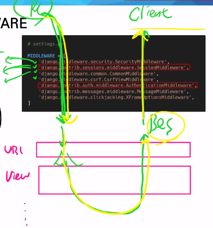

# 사용자 인증 및 권한

- Django 인증 시스템은 django.contrib.auth에 Django contrib module로 제공
  - 별도로 추가로 할 작업은 없음
- setting.py에 INSTALLED_APPS 설정에서 확인
  - django.contrib.auth
  - django.contrib.contenttypes
- Django 인증 시스템은 인증과 권한 부여를 함께 제공(처리)

### Authentication & Authorization

- Authentication 인증
  - 신원 확인, 사용자가 자신이 누구인지 확인하는 것
- Authorization 권한, 허가
  - 인증된 사용자가 수행할 수 있는 작업을 결정
- Django 내부적으로 accounts라는 이름을 사용하고 있기 때문에 

## 쿠키와 세션

### HTTP

- HTML 문서와 같은 리스소(자원, 데이터)들을 가져올 수 있도록 해주는 프로토콜(규칙, 규약)
- 웹에서 이뤄지는 데이터 교환의 기초
- 특징
  - 비연결지향
    - 서버는 클라인언트 요청에 대한 응답을 보낸 후 클라이언트와의 연결을 끊음
  - 무상태
    - 연결을 끊는 순간 클라이언트와 서버 서로의 통신이 끝나기 때문에 상태정보가 유지될 수 없음
    - 요청하는 순간 응답을 받고나면 연결이 끊어지는 것
    - 상태정보가 유지되는 대표적인 경우는 로그인
  - 클라이언트와 서버의 지속적인 관계를 유지하기 위해 쿠키와 세션이 존재

### 쿠키

- 서버가 사용자(클라이언트)의 웹 브라우저에 전송하는 작은 데이터 조각
- 사용자가 웹사이트에 방문할 경우 해당 웹사이트의 서버가 사용자 컴퓨터에 배치하는 작은 기록 정보 파일
  - 서버가 사용자에게 쿠키를 주면 이를 로컬에 KEY-VALUE 형태로 저장
  - 쿠키를 브라우저가 저장해 두었다가 동일한 서버에 재요청할 때 저장된 쿠키를 함께 전송
- 쿠키는 상태가 있는 세션을 만들어줌
  - 로그인 요청을 보낼 때 쿠키를 받음 / 매 요청마다 로그인되어있다고 해당 쿠키를 같이 보내야함
  - 그래서 상태가 유지되어있는 것처럼 보임
    - 상태가 없는 HTTP 프로토콜에서 상태 정보를 기억시켜주기 때문
- 웹 페이지에 접속하면 요청한 웹 페이지를 받으며 서버가 쿠키를 발급해주고 같은 서버에 다음에 재요청할 때는 요청과 함께 쿠키를 전송


- 다른 도메인으론 해당 도메인 쿠키를 보낼 수 없음

#### 쿠키의 사용 목적

- 세션 관리
  - 로그인, 아이디 자동 완성, 공지 하루 안 보기, 팝업 체크, 장바구니 등 정보 관리
  
- 개인화
  - 사용자 선호, 테마 등 설정
  
- 트래킹
  - 사용자 행동 기록 및 분석
  
- 시크릿 브라우저는 쿠키를 사용하지 않아 해당 기능 사용 불가


### 세션

- 서버에 저장되는 데이터 조각
- 쿠키가 세션 정보를 가지는 것, 쿠키가 세션보다 큰 개념
- HTTP의 무상태를 상태가 있는 것처럼 유지시키는 것
- 어떠한 상태를 저장하며 서버에서 세션을 보고 상태를 판단
- 서버가 session id 정보를 쿠키에 담아서 보냄
  - ID는 세션을 구별하기 위해 필요하며, 쿠키에는 ID만 저장함 ID에 대한 값은 서버가 가지고 있음
  - 로그아웃은 이 세션을 삭제하는 작업
- 누구나 볼 수 있기 때문에 단순한 정보만 담아야 함

#### 쿠키와 세션 정리

- 쿠키는 컴퓨터에 저장, 세션은 서버에 저장
- 쿠키와 세션 상태를 유지해 반복작업을 줄임
- 어떠한 상태를 저장해 놓고 사용자가 추가적인 정보 입력을 하지 않아도 사용할 수 있도록 함
  - http통신 상태를 저장할 수 없으니 간단한 상태저장을 위해 쿠키와 세션 사용
  - (참고)websocket 채팅, 스트리밍 서비스 등 계속해서 어떠한 상태, 즉 데이터가 전송되어야 하기 때문에 websocket이 사용되어야 함
- 일반적인 쿠키에는 저장할 수 있는 한계가 있고, 매번 주고 받는 형식이다보니 보안상의 이유로 중요한 정보를 담을 수 없음
- 세션 id를 쿠키 안에 넣어서 주고 받음으로써 해당 id로 서버에 있는 세션과 비교해서 더 많은 상태를 저장하며 통신하는 것


### 쿠키 liftime(수명)

- Session cookies
  - 현재 세션이 종료되면 삭제됨
  - 브라우저가 현재 세션이 종료되는 시기를 정의
    - 현재 브라우저가 종료되면 끝남
- Persistent cookies
  - Expires 속성에 지정된 날짜, Max-Age 속성에 지정된 기간 동안 브라우저에 유지

### Session in Django

- 세션에 대한 key-value를 데이터 베이스에 저장
  - Django DB에 django_session 테이블에 저장됨
- 장고는 세션 아이디를 확인하고 벨류값을 해석해서 우리에게 응답을 줌
- MIDDLEWARE
  - SessionMiddleware
  - AuthenticationMiddleware
  - HTTP 요청과 응답 처리 중간에 작동하는 시스템
  - HTTP 요청이 들어오면 미들웨어를 거쳐 전반적인 점검 진행 후 해당 URL에 등록되어 view로 연결, HTTP 응답 역시 미들웨어를 거쳐서 내보냄
  - 모든 요청은 모든 미들웨어를 통과하게 됨, 각각의 미들웨어가 어떠한 상태, 변수, 함수를 저장하게 됨



- request가 미들웨어를 쭉 통과해서 urls로 들어와서 각각의 뷰함수를 통과한 다음 response로 변해서 다시한번 미들웨어를 통과해 클라이언트에 가게됨


## 로그인

- 로그인은 (로그인 상태를 유지할 수 있는)session을 create하는 과정
- Django는 이에 대한 built-in-forms 제공

### AuthenticationForm

- 사용자 로그인에 대한 정보를 받아 session을 crate해주는 form
- request를 첫번째 인자로 취함 두번째 인자 데이터
- ModelForm이 아니라 form의 상속을 받음
  - 로그인 id/pw는 db에 저장되는 것이 아니고 세션을 만드는 것
    - id/pw는 인증에 사용되는 데이터의 수단일 뿐
  - 회원가입은 db에 저장

### login 함수

- `login(request, user, backend=None)`
- 현재 세션에 연결하려는 인증된 사용자가 있는 경우 login() 함수 필요
  - authentication form을 통과했을 때 필요
  - 인증된 사용자는 form 안에 있음 `form.get_user()`
- requsest와 user를 인자로 받음
- Django의 session framework를 사용해 세션에 user ID를 저장 이 과정이 로그인

```python
# accounts/views.py

from django.shortcuts import render, redirect
from django.contrib.auth import login as auth_login	# login 이름 혼동 막기 위함
from django.contrib.auth.forms import AuthenticationForm

# Create your views here.
def login(request):
    if request.method == 'POST':
        form = AuthenticationForm(request, request.POST)
        if form.is_valid():
            auth_login(request, form.get_user())
            return redirect('articles:index')
    else:
        form = AuthenticationForm()
    context = {
        'form': form
    }
    return render(request, 'accounts/login.html', context)
```

- 로그인
  - 로그인 페이지 요청 GET / 로그인 진행 POST

### get_user()

- AuthenticationForm의 인스턴스 메서드
- 인스턴스의 유효성을 먼저 확인하고 인스턴스가 유효할 때만 user를 제공하려는 구조


## Authentication data in templates


- context_processors
  - 장고 템플릿이 렌더링될 때 자동으로 호출 가능한 컨텍스트 데이터 목록
- Users
  - RequestContext를 렌더링할 때 해당 인스턴스가 `{{ user }}`에 저장
    - 로그인한 사용자를 나타내는 auth.User 인스턴스
    - 로그인하지 않은 경우 AnonymouseUser 인스턴스


## 로그아웃

- 세션을 삭제하는 것
- session을 delete하는 로직과 같음

### logout 함수

- `logout(request)`
- 현재 요청에 대한 session data를 DB에서 삭제, 클라이언트 쿠키에서도 sessionid 삭제
  - 다른 사람이 동일한 웹 브라우저를 사용해 로그인하고 이전 사용자의 세션 데이터에 액세스 하는 것을 방지하기 위함
- 사용자가 로그인하지 않은 경우에도 오류 발생시키지 않음

```python
# accounts/views.py

from django.shortcuts import render, redirect
from django.contrib.auth import logout as auth_logout

def logout(request):
    auth_logout(request)
    return redirect('articles:index')
```


## 로그인 사용자에 대한 접근 제한

- 이 사람이 로그인 한 사람이냐 안 한 사람이냐를 확인하고 싶은 것

### `is_authenticated` attribute 속성

- User_model로 인한 인스턴스 = 인증된 사용자의 인스턴스 항상 True
- AnonymousUser에 대해서는 항상 False
- 사용자가 인증되었는지 여부를 알 수 있는 것 
  - 요청하는 유저가 인증되었는지를 확인
- 보안, 권한에 관련된 것은 확인할 수 없음
- request 객체를 모든 템플릿에서 다 쓸 수 있음
- 로그인 됐는지 안 됐는지를 단순히 확인만 하는 것

### `login_required` decorator

- 로그인되어 있지 않으면 setting.LOGIN_URL에 설정된 문자열 기반 절대 경로로 redirect
  - LOGIN_URL 기본값 'accounts/login/'
    - 두 번째 app 이름을 accounts로 했던 이유 중 하나
- 사용자가 로그인되어 있으면 정상적으로 view함수 실행

### next query string parameter

- 로그인이 정상적으로 진행되면 기존에 요청했던 주소로 redirect 하기 위해 주소를 keep 해주는 것
- 별도 처리가 없다면 view에 설정한 redirect 경로로 이동하게 됨
- next 값은 GET 방식에 딕셔너리 형태로 들어있음

```python
return redirect(request.GET.get('next') or 'articles:index')
```

- form action에 값이 없다면 현재 url(next parameter 값)로 요청 보냄

### 비로그인 상태에서 게시글 삭제 시도 시 문제

```python
# articles/views.py
@login_required
@require_POST
def delete(request, pk):
    article = get_object_or_404(Article, pk=pk)
    article.delete()
    return redirect('articles:index')
```

- `@require_POST`와 `@login_required`를 함께 사용하는 경우 에러 발생
- 로그인 이후 next 매개변수를 따라 해당 함수로(next에 담긴 경로로) 다시 redirect되는데 `@require_POST`에서 405 에러 발생
  - redirect는 애초에 POST 요청이 불가능해서 GET 방식으로 바뀌게 된 것

```python
@require_POST
def delete(request, pk):
    if request.user.is_authenticated: # @login_required와 같은 기능을 속성 값으로 처리
        article = get_object_or_404(Article, pk=pk)
        article.delete()
    return redirect('articles:index')
```

- POST 요청인지 먼저 확인 한 후 로그인이 되어있다면 게시글 삭제하는 형식으로 바꾸어 처리


## 회원가입

### UserCreationForm

- ModelForm
  - username, password1, password2(비밀번호 확인) 3가지 필드를 가짐


```python
# accounts/ views.py

from django.shortcuts import render, redirect
from django.contrib.auth import login as auth_login
from django.contrib.auth.forms import UserCreationForm

def signup(request):
    if request.method == 'POST':
        form = UserCreationForm(request.POST)
        if form.is_valid():
            user = form.save()
            auth_login(request, user) # 회원가입 후 자동 로그인
            return redirect('articles:index')
    else:
        form = UserCreationForm()
    context = {
        'form': form,
    }
    return render(request, 'accounts/signup.html', context)
```


## 회원 탈퇴

- DB에서 사용자를 삭제

```python
# accounts/views.py

from django.shortcuts import render, redirect
from django.contrib.auth import logout as auth_logout
from django.views.decorators.http import require_POST

@require_POST
def delete(request):
    if request.user.is_authenticated:
        request.user.delete()
        auth_logout(request)
    return redirect('articles:index')
```

- 반드시 탈퇴 후 로그아웃 순으로 처리해야 함


## 회원정보 수정

### UserChangeForm

- admin인터페이스에서 사용되는 ModelForm
  - admin페이지에서 회원정보 수정 때 보여지는 form
- 일반 사용자가 접근해선 안 될 정보들(fields)까지 모두 수정 가능한 문제가 존재
- UserChangeForm을 상속받아 CustomUserChangeForm이라는 서브클래스를 작성해 접근 가능한 필드를 조정해야 함

### CustomUserChangeForm

```python
from django.contrib.auth.forms import UserChangeForm
from django.contrib.auth import get_user_model

class CustomUserChangeForm(UserChangeForm):
    
    class Meta:
        model = get_user_model()
        fields = ('email', 'first_name', 'last_name',)
```

- get_user_model()	
  - 현재 프로젝트에서 사용하는 user class를 리턴하는 함수
- fields
  - 수정 시 필요한 필드만 선택해 작성

```python
# accounts/views.py

from django.contrib.auth.decorators import login_required
from .forms import CustomUserChangeForm
from django.views.decorators.http import require_http_methods

@login_required
@require_http_methods(['GET', 'POST'])
def update(request):
    if request.method == 'POST':
        form = CustomUserChangeForm(request.POST, instance=request.user)
        if form.is_valid():
            form.save()
            return redirect('articles:index')
    else:
        form = CustomUserChangeForm(instance=reuqest.user)
    context = {
        'form': form,
    }
    return render(request, 'accounts/update.html', context)
```


## 비밀번호 변경

### PasswordChangeForm

- SetPassworldForm을 상속받는 서브 클래스이기 때문에 첫 번째 인자로 user가 옴

### 암호 변경시 세션 무효화 방지

- `update_session_auth_hash(request, user)`
  - 비밀번호가 변경되면 기존 세션과 일치하지 않게 되어 로그인 상태를 유지할 수 없음
  - 암호가 변경되어도 로그아웃되지 않도록 새로운 password hash로 session 업데이트

```python
from django.contrib.auth.decorators import login_required
from django.contrib.auth.forms import PasswordChangeForm
from django.contrib.auth import update_Session_auth_hash
from django.views.decorators.http import require_http_methods

@login_required
@require_http_methods(['GET', 'POST'])
def change_password(request):
    if request.method == 'POST':
        form = PasswordChangeForm(request.user, request.POST)
        if form.is_valid():
            form.save()
            update_session_auth_hash(request, form.user)
            return redirect('index')
    else:
        form = PasswordChangeForm(request.user)
    context = {
        'form': form,
    }
    return render(request, 'accounts/change_password.html', context)
```

