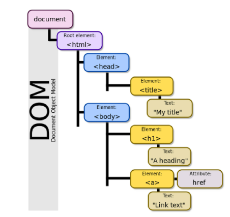
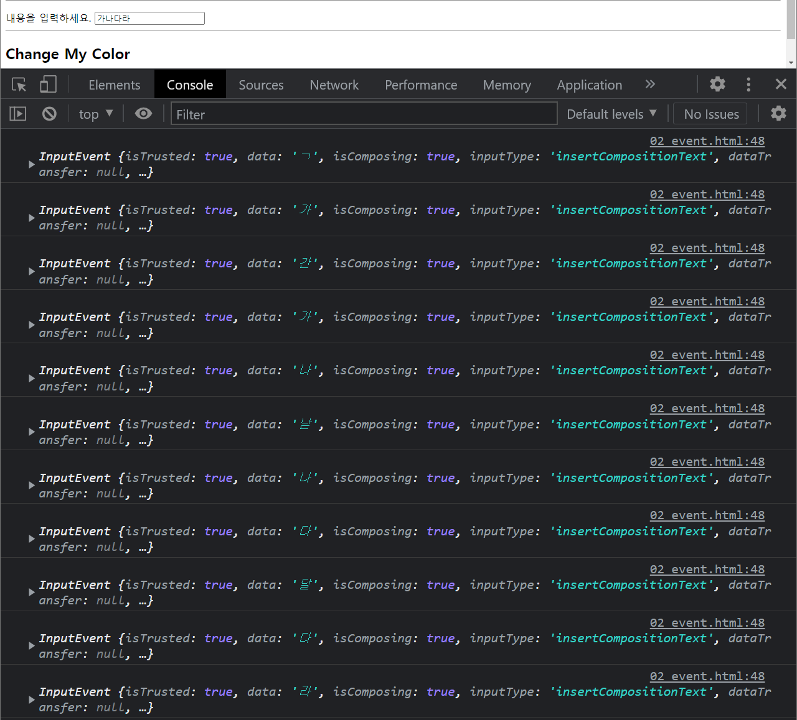

# JavaScript 심화

## DOM(Document Object Model)

- 문서를 다루기 위해선 어떤 객체를 접근해야 함
- 문자열 덩어리를 파싱하면 DOM이라는 객체가 됨
-  .으로 key접근
- 문서를 접근한다는 건 그게 해석된 객체를 접근한다는 것



## DOM 조작

- 선택과 변경
- document안에 어떤 키값으로 접근 
  - 그러나 계속 .으로 접근은 어려움
- 선택한 무언가를 잡아서 변경하는 것

### DOM 관련 객체의 상속 구조

- EventTarget
- Node
  - 어떤 존재를 상징
- Element
- Document
  - HTML 파일을 상징하는 객체
- HTMLElement
  - p태그 같은 것들

### DOM 선택

#### 선택 관련 메서드

- `document.querySelector(selector)`
  - CSS selector를 만족하는 첫번째 element 객체를 반환
- `document.querySelectorAll(selector)`
  - 일치하는 모든 element를 담아서 NodeList 객체를 반환
- 그 외
  - `getElementById(id), getElementByTagName(name), getElementByClassName(names)`
- `querySelector(), querySelectorAll()`을 사용하는 이유
  - id, class, tag선택자 모두 사용 가능 훨씬 더 유연하게 사용가능
  - css에선 id 잘 안 썼음 js에서 활용하기 위함
- `>`를 쓰는 방식보다 id를 쓰는 방식이 더 좋음
  - `>`를 쓰는 방식은 마크업이 바뀔 경우 이 루트도 바꿔줘야함


- HTMLCollection
- NodeList
  - index로만 각 항목 접근 가능
  - 배열에서 사용하는 메서드 사용 가능 `forEach` 등
- 객체는 접근 + 접근해서 수정까지 가능

### DOM 변경

#### 변경 관련 메서드

##### Creation

- `document.createElement()`
- 작성한 태그 명의 HTML 요소를 생성해 반환
- 존재만 할 뿐 화면에 나타나진 않음

##### append DOM

- createElement 결과물인 Node를 화면 어딘가에 붙여주어야 나타나는데 이 때 부모요소에 붙임
- `Element.append()`
  - 특정 부모 Node의 자식 NodeList 중 마지막 자식 다음에 Node 객체나 DOMString 삽입
    - 태그가 아닌 문자열도 추가가 가능은 하나 잘 쓰지 않음
  - 한 번에 여러 개의 자식 요소를 설정할 수 있음
- `Node.appendChild()`
  - 한 Node를 특정 부모 Node의 자식 NodeList 중 마지막 자식으로 삽입
  - Node에 하나의 Node만 추가 가능

#### 변경 관련 속성

- `Node.innerText`
  - 태그를 빼고 문자열로 처리
- `Element.innerHTML`
  - HTML 마크업을 반환, 마크업 해석
  - 그러나 쓰면 안 됨 - XSS 공격에 취약
    - 사용자의 입력을 받을 때 위험 inner HTML로 받는다 하면 사용자가 스크립트 코드를 입력할 수 있어 웹페이지를 마음대로 조작할 수 있게되는 것 

#### 삭제 관련 메서드

- `ChildNode.remove()`
- `Node.removeChild()`
  - 삭제되고 남아있어 변수에 저장해 위치를 바꿀 때 쓸 수 있음

#### 속성 관련 메서드

- `Element.setAttribute(name, value)`

  - 지정된 요소의 값 설정
  - 클래스, 스타일 등 추가
    - 다른 방식 존재 `Element.classList.add()` / `Element.style.~`
    - `element.width = '600'` 숫자만 px 등 단위 붙여선 안 됨
      - 문제는 px를 붙여도 되는 style 요소도 존재 
      - CSS는 따로 설정하자
  - 편리함과 재사용성 면에서 CSS 값을 설정하고 `setAttribute('class', 'class명')`로 클래스를 주는 것이 가장 심플

- `Element.getAttribute(attributeName)`

  - 특정 어트리뷰트에 지정된 값을 가지고 올 수 있음 
  - 단순하게 값을 가지고 오는 것

  

## Event

- 네트워크 활동이나 사용자와의 상호작용 같은 사건의 발생을 알리기 위한 객체
  - 네트워크 활동, 사용자와의 상호작용을 캐치해 내는데 필요
- 간단히 말해 event는 사용자와 상호 작용하는 것
- 이벤트 발생
  - 마우스 클릭, 마우스 움직임, 키보드 입력과 같은 브라우저가 감지해낼 수 있는 사건
    - MouseEvent, KeyboardEvent, InputEvent, FocusEvent, ClipboardEvent, ...
  - 이벤트를 캐치해서 정말 동적인 프로그래밍을 만들어낼 수 있음

### Event handler

- `EvnetTarget.addEventListener(type, listener)`

  - 이벤트가 대상에서 발생할 때마다 호출될 함수를 설정
    - 함수 === '일'의 단위
  - EventTarget 
    - 가장 상위 구조
    - 모든 요소는 다 이벤트를 달아줄 수 있음
    - 쿼리 셀렉터로 선택한 변수가 옴
  - type
    - 어떤 이벤트가 발생할지 해당 이벤트의 종류
      - `click`, `input`,`submit` 등 [다양](https://developer.mozilla.org/ko/docs/Web/Events)
  - listener
    - 동작 혹은 일에 대한 명세, 콜백함수(인자로 들어가는 함수)
    - 함수는 일 혹은 동작을 정의하는 것, 실제로 일은 호출됐을 때 하는 것
    - listener에 함수를 넣는 것은 실제 동작을 하자는 것이 아니라 명세를 넣어놓는 것
    - 보통 익명함수로 바로 적어줌 
  - 대상(EventTarget)에 특정 이벤트(type)가 발생하면, 할 일(listener)을 등록하자

  ```javascript
  const alertMessage = function () {
      alert('메롱!!!') // 최근 웹페이지에선 잘 안 씀
  }
  const myButton = document.querySelector('#my-button')
  myButton.addEventListener('click', alertMessage) // 함수라는 값, 함수 그 자체를 넘김
  myButton.addEventListener('click', alertMessage()) // 함수의 리턴 값을 넘김 
  											// undefined alertMessage에는 return값이 없음 
  ```

  - `( )` 쓰고 안 쓰고는 굉장히 큰 차이
    - 안 쓸 경우: 함수 그 자체를 넘김
    - 쓸 경우: 함수의 리턴 값을 넘김, return 값이 없을 경우 `undefined`를 넘김
  - `addeventlistenr`가 필요로 하는 건 명세지 결과가 아님

  ```javascript
      const myTextInput = document.querySelector('#my-text-input')
  
      const ifInputIsComing = function (event) {
        console.log(event);
      }
  
      myTextInput.addEventListener('input', ifInputIsComing)
  ```

  - `input` 키보드를 치는 행위

  

  - `console.log(event)`

    - 입력한 모든 행위가 찍히고 있음
    - 입력 메세지가 순간순간마다 캐치되고 있음

    

  - 매번 실행될 이유가 있는 코드일까? 마지막에 생각해보기

  

  ### Event 취소

  - `event.preventDefault()`
    - 이벤트의 기본동작, HTML 요소의 기본 동작 중단
      - a태그 링크 이동, 체크박스 체크, form 데이터 전송 등
    - 클릭 같은 행위는 일어나는 것
    - 폼 제출은 엔터와 버튼 클릭 둘 다 막아야 하는데 이땐 그냥 폼 전송 자체를 막아버리자
  - 취소할 수 없는 이벤트도 존재
    - scroll 등 대부분


- button / input form안에 있으면 동작 form 밖에 있으면 동작x
  - form태그 안에 있으면 button이 input type submit과 같은 동작을 하게 됨