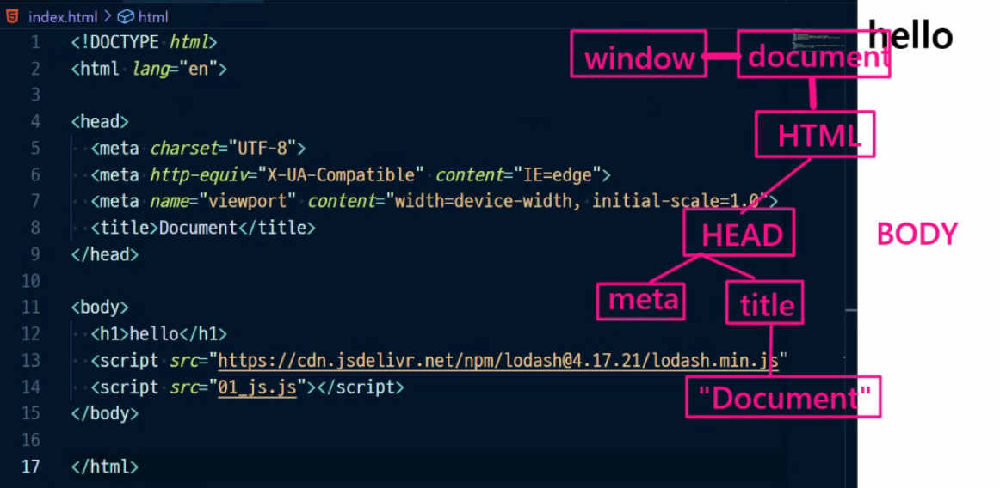

# JavaScript 심화

## DOM(Document Object Model)

- DOM은 웹페이지에 나타난 HTML문서 전체를 각각에 대해 객체로 나타낸 것

  - 각각의 요소를 객체로 접근한다는 게 포인트

- 각각의 객체이기 때문에 단순한 속성으로 접근하고 메서드를 활용할 수 있게 됨

- 문자열 덩어리를 파싱하면 DOM이라는 객체가 됨

  - 문서를 다루기 위해선 어떤 객체를 접근해야 함
  - 문서를 접근한다는 건 그게 해석된 객체를 접근한다는 것

- window가 자바스크립트의 가장 최상위 객체 

  - 모든 것들이 결국 window안에 있는 걸 쓰는 것이기 때문에 이를 생략할 수 있는 것
  - 자바스크립트 코드 어디서든 접근할 수 있는 객체: 전역객체

- DOM 트리 구조에서 각각의 객체를 노드라고 표현

  

  - HEAD 입장에서 HTML은 부모노드 BODY는 형제노드 document는 조상노드 meta, title 자식노드 그 밑은 자손노드
  - "Document"라는 텍스트 노드는 자식노드를 가질 수 없음 leaf node 
  - 태그를 표현하는 노드는 요소로드, 문자를 나타내는 노드를 텍스트 노드라 함


## DOM 조작

- 선택과 변경
- document안에 어떤 키값으로 접근 
  - 그러나 계속 `.`으로 접근은 어려움 -> 메서드 활용
- 선택한 무언가를 잡아서 변경하는 것

### DOM 관련 객체의 상속 구조

- EventTarget
- Node
  - 어떤 존재를 상징
  - DOM 트리 구조에서 각각의 객체
- Element
- Document
  - HTML 파일을 상징하는 객체
- HTMLElement
  - p태그 같은 것들

### DOM 선택

#### 선택 관련 메서드

- `document.querySelector(selector)`
  - CSS selector를 만족하는 첫번째 element 객체를 반환
- `document.querySelectorAll(selector)`
  - 일치하는 모든 element를 담아서 NodeList 객체를 반환
- 그 외
  - `getElementById(id), getElementByTagName(name), getElementByClassName(names)`
- `querySelector(), querySelectorAll()`을 사용하는 이유
  - id, class, tag선택자 모두 사용 가능 훨씬 더 유연하게 사용가능
- CSS에서 id 잘 안 썼음, js에서 활용하기 위함

- `>`를 쓰는 방식보다 id를 쓰는 방식이 더 좋음
  - `>`를 쓰는 방식은 마크업이 바뀔 경우 이 루트도 바꿔줘야함

- 자식 노드
  - `Element.firstElementChild`
  - `Element.children`
    - 내가 선택한 자식 노드의 자식 노드들을 모두 유사 배열로 가져옴
- 부모 노드
  - `Node.parentElement`
- 형제 노드
  - `Element.previousElementSibling`
  - `Element.nextElementSibling`

- NodeList

  

  - `querySelectorAll`로 가져온 `NodeList`를 유사배열이라고 함
  - index로만 각 항목 접근 가능
  - 배열에서 사용하는 메서드 사용 가능 `forEach` 등

- 객체는 접근 + 접근해서 수정까지 가능

### DOM 변경

#### 변경 관련 메서드

##### Creation

- `document.createElement()`
- 작성한 태그 명의 HTML 요소를 생성해 반환
- 존재만 할 뿐 화면에 나타나진 않음

##### append DOM

- 노드 이동과 관련
- `createElement` 결과물인 Node를 화면 어딘가에 붙여주어야 나타나는데 이 때 부모요소에 붙임
- `Element.append()`
  - 특정 부모 Node의 자식 NodeList 중 마지막 자식 다음에 Node 객체나 DOMString 삽입
    - 태그가 아닌 문자열도 추가가 가능은 하나 잘 쓰지 않음
  - 한 번에 여러 개의 자식 요소를 설정할 수 있음
- `Node.appendChild()`
  - 한 Node를 특정 부모 Node의 자식 NodeList 중 마지막 자식으로 삽입
  - Node에 하나의 Node만 추가 가능
  - 추가된 Node 객체를 반환
- `prepend`
- `after`
- `before`

#### 변경 관련 속성

- `Node.innerText`
  - 태그를 빼고 문자열로 처리
- `Node.textContent`
  - HTML을 제외한 텍스트를 가져옴
- `innerText`와 `textContent`의 차이점
  - `textContent`는 `<script>`와 `<style>`요소를 포함한 모든 요소의 콘텐츠를 가져오는 반면 `innerText`는 스타일링을 고려하며 사람이 읽을 수 있는 요소만 반환
  - `innerText`값을 읽으면 CSS 고려로 인해 계신 계산값을 반영하기 위한 리플로우가 발생하기 때문에 가능하면 피해야함
- `Element.innerHTML`
  - HTML 마크업을 반환, HTML 자체를 문자열로 리턴
  - 그러나 쓰면 안 됨 - XSS 공격에 취약
    - 사용자의 입력을 받을 때 위험 inner HTML로 받는다 하면 사용자가 스크립트 코드를 입력할 수 있어 웹페이지를 마음대로 조작할 수 있게되는 것 

#### 삭제 관련 메서드

- `ChildNode.remove()`
- `Node.removeChild()`
  - 제거된 Node를 반환
    - 변수에 저장해 위치를 바꿀 때 쓸 수 있음

#### 속성 관련 메서드

- `Element.setAttribute(name, value)`

  - 지정된 요소의 값 설정
  - 속성이 이미 존재하면 값을 갱신 즉 수정하며 없으면 새 속성을 추가함
  - `name`에서 대소문자를 구분하지 않음
  - style 값을 줄 때 `setAttribute`를 활용하는 이유
    - `Element.style.~`로 값을 주게되면 inline style로 들어가 스타일 우선순위가 높아짐
    - 같은 스타일을 다른 여러 코드에 주려면 똑같은 코드가 반복됨
    - `element.width = '600'` 숫자만 px 등 단위 붙여선 안 되나 px를 붙여도 되는 style 요소도 존재하는 등 다양한 문제 발생
    - 편리함과 재사용성 면에서 stylesheet에 CSS 값을 설정하고 class 혹은 id를 주는 것이 가장 심플
- `Element.getAttribute(attributeName)`
  - 특정 attribute에 지정된 값 반환
  - 단순하게 값을 가지고 오는 것

- `Element.classList`
  - 어떠한 node의 className을 자바스크립트로 변경하면 class 전체가 변경됨
  - class를 여러 개를 사용하고 싶어 단순히 추가만 하길 원한다면 classList를 사용해야함
  - 클래스 속성을 하나씩 다룰 수 있게됨
  - `add`, `remove`, `toggle` 형식 지원
    - toggle 있으면 제거 없으면 추가해주는 것


## Event

- 네트워크 활동이나 사용자와의 상호작용 같은 사건의 발생을 알리기 위한 객체
  - 네트워크 활동, 사용자와의 상호작용을 캐치해 내는데 필요
- 간단히 말해 event는 사용자와 상호 작용하는 것
- 이벤트 발생
  - 마우스 클릭, 마우스 움직임, 키보드 입력과 같은 브라우저가 감지해낼 수 있는 사건
    - MouseEvent, KeyboardEvent, InputEvent, FocusEvent, ClipboardEvent, ...
  - 이벤트를 캐치해서 정말 동적인 프로그래밍을 만들어낼 수 있음

### Event handler

- `EvnetTarget.addEventListener(type, listener)` // `EventTarget.removeEventListener()`

  - type을 event trigger / listener를 event handler 라고도 함
  - 이벤트가 대상에서 발생할 때마다 호출될 함수를 설정
    - 함수 === '일'의 단위
  - EventTarget 
    - 가장 상위 구조
    - 모든 요소는 다 이벤트를 달아줄 수 있음
    - 쿼리 셀렉터로 선택한 변수가 옴
  - type
    - 어떤 이벤트가 발생할지 해당 이벤트의 종류
      - `click`, `input`,`submit` 등 [다양](https://developer.mozilla.org/ko/docs/Web/Events)
  - listener
    - 동작 혹은 일에 대한 명세, 콜백함수(인자로 들어가는 함수)
    - 함수는 일 혹은 동작을 정의하는 것, 실제로 일은 호출됐을 때 하는 것
    - listener에 함수를 넣는 것은 실제 동작을 하자는 것이 아니라 명세를 넣어놓는 것
    - 익명함수로 바로 적어줄 수 있음 
    - 그러나 익명함수로 handler에 적어줄 경우 `removeEventListener()`로 삭제할 수 없기 때문에 이를 사용하기 위해선 선언형으로 함수를 선언해 callback 함수에 등록하는 형태로 써야함
  - 대상(EventTarget)에 특정 이벤트(type)가 발생하면, 할 일(listener)을 등록하자
  
  ```javascript
  const alertMessage = function () {
      alert('메롱!!!') // 최근 웹페이지에선 잘 안 씀
  }
  const myButton = document.querySelector('#my-button')
  myButton.addEventListener('click', alertMessage) // 함수라는 값, 함수 그 자체를 넘김
  myButton.addEventListener('click', alertMessage()) // 함수의 리턴 값을 넘김 
  											// undefined alertMessage에는 return값이 없음 
  ```
  
  - `( )` 쓰고 안 쓰고는 굉장히 큰 차이
    - 안 쓸 경우: 함수 그 자체를 넘김
    - 쓸 경우: 함수의 리턴 값을 넘김, return 값이 없을 경우 `undefined`를 넘김
  - `addeventlistenr`가 필요로 하는 건 명세지 결과가 아님
  
  
  
  - 어떠한 이벤트 객체를 계속해서 콜백함수로 넘겨주지만 매개변수로 받아주지 않으면 보이지 않음
  
  ```javascript
      const myTextInput = document.querySelector('#my-text-input')
  
      const ifInputIsComing = function (event) {
        console.log(event);
        console.log(event.target)
      }
  
      myTextInput.addEventListener('input', ifInputIsComing)
  ```
  
  
  
  - 입력 메세지가 순간순간마다 캐치되고 있음

  - `event.target` 구조는 많이 사용하게 됨
    - 클릭하는 것 하나하나를 조작할 수 있게 됨
  
  
  
  ### Event bubbling
  
  ```javascript
  const contentElem = document.querySelector('#content')
  const listElem = document.querySelector('#list-1')
  
  function myClick(e) {
    console.log('hello')
    console.log(e.target)
    console.log(e.currentTarget)
  }
  
  contentElem.addEventListener('click', myClick)
  listElem.addEventListener('click', myClick)
  ```
  
  - list1 클릭하면 클릭 2번 한 것처럼 myClick 2번 실행됨
  
  - 하위 객체에서 이벤트를 수행할 때 상위 객체의 이벤트도 일어나는 것
  
    - 맨 아래에서 버블을 하나 생성햇는데 뽀글뽀글 올라가면서 계속 이벤트가 생겨나는 느낌
  
    
  
    - list1 영역은 content 영역이기도 함
  
    - 같은 이벤트를 갖는 것 끼리만 일어남, 같은 event trigger/type일 때만
  
      - 둘 다 `click`이벤트일 때는 발생하지만 `click`, `submit` 등 다른 type의 이벤트일 경우 bubbling이 발생하지 않음
  
    - document 객체를 만날 때 까지 event 버블링이 내부적으로 계속됨
  
    - event bubbling을 막을 수 있는 방법: `Event.stopPropagation()`
  
      ```javascript
      listElem.addEventListener('click', function (e) {
        e.stopPropagation()
        myClick(e)
      })
      ```
  
  
  
  ### Event 취소
  
  - `event.preventDefault()`
    - 이벤트의 기본동작, HTML 요소의 기본 동작 중단
      - a태그 링크 이동, 체크박스 체크, form 데이터 전송 등
    - 클릭 같은 행위는 일어나는 것
    - 폼 제출은 엔터와 버튼 클릭 둘 다 막아야 하는데 이땐 그냥 폼 전송 자체를 막아버리자
  - 취소할 수 없는 이벤트도 존재
    - scroll 등 대부분


매번 실행될 이유가 있는 코드일까? 마지막에 생각해보기

- button / input form안에 있으면 동작 form 밖에 있으면 동작x
  - form태그 안에 있으면 button이 input type submit과 같은 동작을 하게 됨