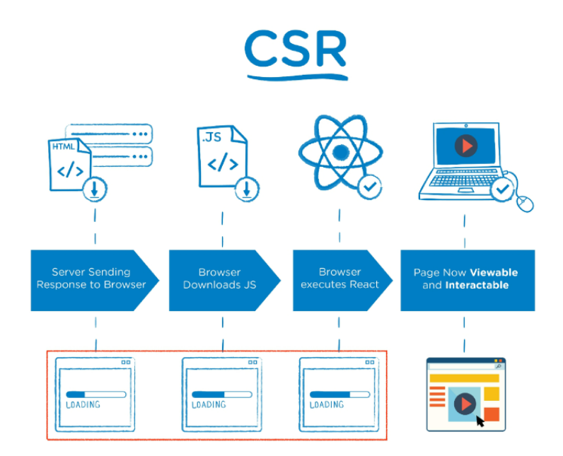
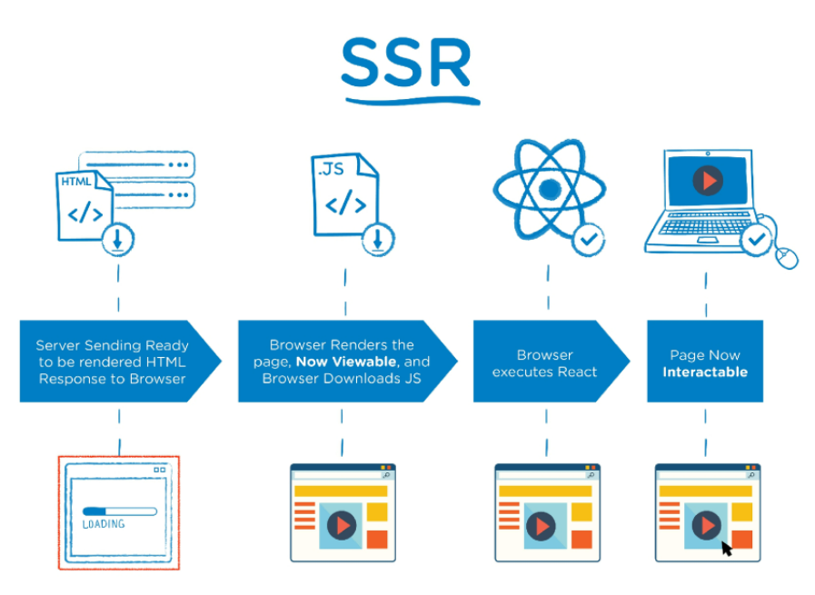
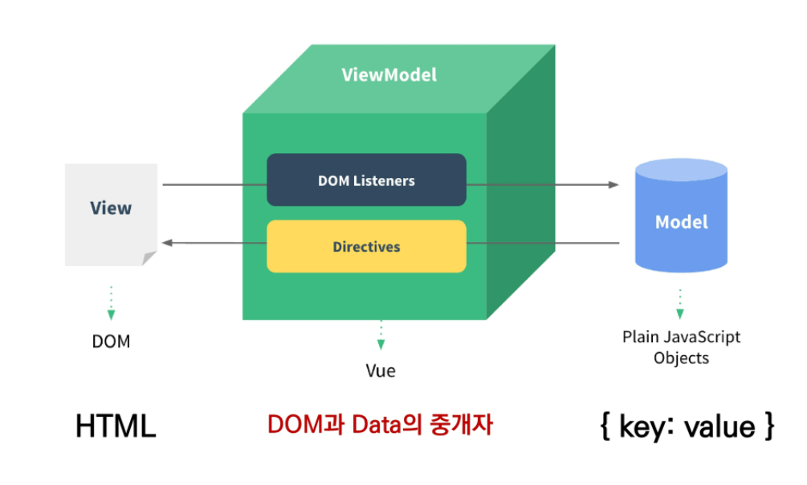

# Vue.js 기초

## Vue.js

- 프론트엔트, 클라이언트 개발의 핵심은 HTML, CSS, JS를 통해 사용자에게 화면(UI)을 보여주는 것
- 데이터베이스 테이블 안에 있는 데이터를 사용자가 잘 볼 수 있게, 사용자가 데이터를 생성, 수정, 삭제 할 수 있게끔 하는 것
- 사용자와 데이터베이스,서버 / 비지니스로직과 데이터를 / 사용자가 친근하게 서비스와 상호작용이 가능하게 하는 것이 본질
- 사용자 인터페이스(화면)을 만들기 위한 자바스크립트 프레임워크
- SPA(Single Page Application) 지원

### SPA

- Single Page Application
- 서버로부터 최초에만 페이지 하나를 다운로드하고 이후에는 동적으로 사용자 조작에 따라 DOM을 구성(변경)
- 처음의 전체 페이지를 받아온 후 스크립트가 내용을 바꿔주는데 이 때 필요한 부분만 동적으로 다시 작성
- 사용자가 조작함에 있어 보고 있는 하나의 페이지를 동적으로 바꿔주는 것을 렌더링이라 함
- 연속되는 페이지 사용자 경험 향상
  - 서비스에 오래 머물 수 있도록 더 좋은 경험을 제공
- 동작 원리의 일부가 CSR(Client Side Rendering) 구조 따름
- 우리가 보는 대부분의 웹페이지는 SPA
- 장고같은 경우 HTML을 여러 개 만들어 페이지가 굉장히 많이 있음
- Vue로 만들게 될 애플리케이션은 HTML 한장으로 모든 게 구성
- 등장배경
  - 네이티브앱 - 스토어에서 다운 받는 앱
  - 프레임워크 = 틀 + 일
    - 어떠한 틀속에서 일하게 되면 몇 몇 부분만 고민해서 바꾸면 됨
    - 핵심에만 집중할 수 있음
  - 효과적인 개발을 위함

### CSR  & SSR

#### CSR

- Client Side Rendering

- 처음엔 뼈대만 받고 브라우저에서 동적으로 DOM을 그림

- 스크립트 코드를 작성해 클라이언트에 넘기면 브라우저가 스크립트 코드를 해석해 화면에 띄워줌

  - 명세서를 JS로 다 작성해 스크립트의 비중이 올라감

  

- 장점

  - 사용자가 오래 머문다면 트래픽이 감소됨
    - 초반에 모든 정적 리소스를 다운받고 필요한 데이터만 갱신하기 때문 
  - 사용자 경험(UX) 향상
    - 전체 페이지를 다시 렌더링하지 않고 변경되는 부분만 갱신하기 때문

- 단점

  - SSR에 비해 최종 렌더링 시점이 느림
  - SEO(검색 엔진 최적화) 어려움
    - 마크업으로 기능하기 때문

#### SSR

- Server Side Rendering

- 장고를 생각하면 됨 - 장고 템플릿 엔진, 장고 = 서버

- 장고 내부의 템플릿 엔진이 렌더링해 HTML 파일 한 장을 return 해줌

  - 적어놓은 코드를 해석해서 HTML문서로 바꾸는 것이 렌더링

- 서버에서 클라이언트에게 보여줄 페이지를 구성해서 전달하는 방식

  - 서버가 HTML 완전 최종본을 넘김

  

- 장점

  - 초기 구동 속도가 빠름
    - 클라이언트(유저)가 한 번에 모든 페이지를 바로 볼 수 있음
      - 다 렌더링되서 넘어오기 때문
  - SEO(검색 엔진 최적화)에 적합

- 단점

  - 사용자 요청할 때마다 새로운 페이지를 구성해서 전달 해줘야 함
    - 반복되는 새로고침으로 사용자 경험이 떨어짐
    - 이런 사용자가 많아지면 엄청난 트래픽이 몰리게 됨

- SSR과 CSR 차이의 핵심은 누가 HTML을 만드냐임, 최종 HTML 생성 주체가 누구인가
  - 렌더링을 서버가 한다면 SSR, 클라이언트가 한다면 CSR
- CSR이 비용적인 측면에서 이득
  - 브라우저 결국 클라이언트가 일하게 됨
- 실제 서비스에서는 SSR 위에 부분적인 CSR요소가 존재
  - 검색 엔진 최적화를 위한 것은 SSR로 나머지는 CSR로 
  - 서버 측에서는 렌더링해 돌려줘야 할 것이 빠져 리소스가 줄어들게 되며 클라이언트는 일부만 렌더링해서 쓰기 때문에 사용자 경험이 올라감

### SEO

- Search Engine Optimization (검색 엔진 최적화)
- 구글 검색엔진이 모든 웹페이지를 돌아다니며 HTML코드를 분석해 검색했을 때 바로 알맞은 결과가 나오게끔 최적화하고 있음
- SSR의 경우 서버에서 모든 웹페이지를 만들어 클라이언트에 돌려주기 때문에 검색 엔진 최적화에 적합함
- 검색 엔진 최적화는 굉장히 중요
  - 검색 엔진 최적화를 위해 별도의 프레임워크를 사용하기도 함


### Why Vue.js?

- 하나의 어플리케이션에서 페이지가 너무 많아 바닐라 js만으로는 어려움
- 모든 요소를 선택해서 이벤트를 등록하고 값을 변경하는 과정을 쉽게 동적으로 해주는 것이 프레임워크
- vue는 일일히 명령하는게 아닌 하나의 데이터로 관리
  - DOM과 데이터가 알아서 연결되어 데이터를 변경하면 연결된 DOM이 알아서 변경
  - 데이터 관리에만 신경쓰면 되어 Develop Exp 향상


## Conceopts of  Vue.js

### MVVM Pattern



- Model 

  - 자바스크립트 객체
  - Vue Instance 내부의 data

- View 

  - 최종적으로 만들어야하는 HTML
    - DOM

  - 실제로 사용자가 보고 있는 것
  - data의 변화에 따라 바뀌는 대상

- View Model

  - Vue.js 즉,  Vue Instance

  - 데이터를 가지고 DOM구조를 만들어주는 것
  - view를 클론한 가상dom을 내부적으로 가지고 있음
  - Model의 데이터가 변경되면 가상DOM과 실제 사용자 DOM을 비교해 달라진 걸 발견하면 변경사항을 DOM 구조에 반영, 알아서 갱신해줌
    - reactivity 데이터 바뀌자마자 바로바로 화면을 알아서 그려줌
  - View와 Model 사이에서 data와 DOM에 관련된 모든 일 처리


## Basic syntax of Vue.js

```vue
 <div id="app">
    <button v-on:click="myFunc">a</button>
    <button @click="yourFunc">b</button>
  </div>

  <script src="https://cdn.jsdelivr.net/npm/vue/dist/vue.js"></script>
  <script>
    const vm = new Vue({
      el: "#app",
      data: {
        a: 1,
      },
      methods: {
        myFunc: function () {
          console.log(this) // Vue instance
        },
       // 이 형태도 가능
       // myFunc() {
       //   console.log(this)
       // },
        yourFunc: () => {
          console.log(this); // window
        }
      }
    })
```

