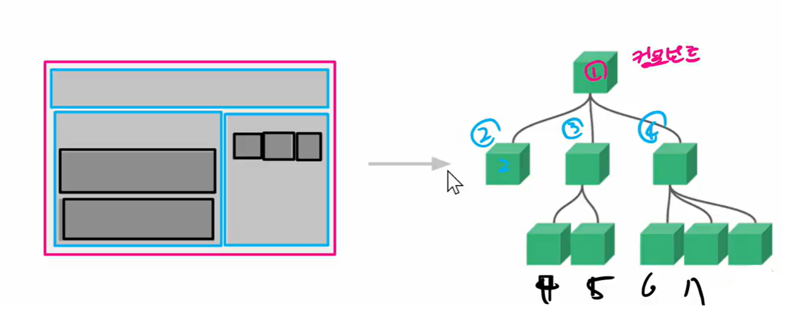

# Vue CLI

## SFC

### Component

- 다시 쓸 수 있는 부품과 같은 것
- 각각의 컴포넌트를 따로 만들어 하나의 화면으로 조립하는 것이 오늘날 프론트엔드 프레임워크의 개발 방식
- Vue component === Vue instance
  - Vue instance를 생성하면 이것이 root component가 됨

- 컴포넌트 종류
  - 전역 컴포넌트 --> 개발할 때 거의 쓰지 않음
    - 여러 vue 인스턴스에서 공통으로 사용이 가능 (접근 가능)
    - vue로 접근 가능한 모든 범위에서 사용 가능(접근 가능)
  - 지역 컴포넌트 --> 대부분 개발은 지역 컴포넌트로
    - 해당 인스턴스 내에서만 사용이 가능한 컴포넌트
- 단일 파일에서의 개발
  - 변수 관리, 유지 보수 힘듦
- 한 화면 구성하는 여러 컴포넌트 
  - 하나의 파일을 모듈화, 패키지화
    - 하나하나가 다 컴포넌트
  - 기능하는 부품단위로 쪼개고 합치는 식, 장고의 include
  - 기능별로 유지, 보수 비용 감소

### SFC (Single File Component)

- .vue 파일 확장자를 가지고 있는 파일은 HTML, CSS, JS로 구성
- .vue 파일 하나가 하나의 component가 됨

### Vue Component 구조

- 트리 형태

  

- Vue component는 곧 Vue instance

  - 반드시 파일 단위로 구분되는 건 아님
  - 그러나 사실상 하나의 파일이 곧 하나의 컴포넌트

- 컴포넌트 간 관계가 생김

  - 부모-자식컴포넌트 컴포넌트 간 상하 관계가 생김 / 형제 컴포넌트 관계도 존재

## Vue CLI

### Node.js

- Vue CLI 쓰기 위해서 Node.js 설치
- 자바스크립트 브라우저 안에서만 존재하는 언어 이를 브라우저 밖에서 범용적으로 사용할 수 없을까?
- node.js는 언어가 아니라 플랫폼 브라우저 밖에서도 자바스크립트 코드가 돌아갈 수 있는 환경을 제공
  - 자바스크립트 런타임 환경
- 자바스크립트를 컴퓨터에서 쓸 수 있게 됨

### NPM (Node Package Manage)

- Node.js의 NPM은 Python의 pip와 같은 역할 
- vue라는 말을 주체로 쓸 수 있게 됨 vue라는 말로 무언가를 실행 -> 프로젝트 생성
- `npm install -g @vue/cli`
  - 각각의 프로젝트에 따로 설치되는 것이 기본
  - `-g`: global, 컴퓨터 전체에 설치되게 됨 
    - 설치 문서에 `-g`가 명시되어있는 경우만 사용

### Vue CLI Quick Start

- 프로젝트 생성 
  - `vue create 앱 이름`
- Vue 버전 선택
  - `Default ([vue2] babel, eslint)` 현재 사용하는 버전 선택
- 프로젝트 생성 창이 뜨면 해당 프로젝트 디렉토리로 이동
- 서버 실행
  - `npm run serve`
- 메인 페이지 실행해 기본화면 확인

## Babel & Webpack

- Vue CLI에 초기 설정 되어 있음

### Babel

- 컴파일러
- 2015년 이후 코드(최신 문법)를 구버전으로 번역해주는 도구
- 최신식 자바스크립트 문법을 이해하지 못 하는 브라우저가 이해할 수 있도록 바꿔주는 것
  - 모든 브라우저에서 동작 가능해짐
  - 개발자의 고민 덜어짐

### Webpack

- static module bundler 
- 모듈 간 의존성 문제를 해결하기 위한 도구

#### module

- 모듈은 파일 하나를 의미, 파일 하나 === 모듈 하나
- 설치되있는 걸 관리
- 여러 가지 방식의 import 방식 등장
  - 자바스크립트는 브라우저마다 달랐다보니 import도 여러 가지
  - 사실상 현재의 표준은 ESM
- script cdn 모듈은 종속성이 강하며 또 많은 모듈이 서로 의존
  - Webpack은 이러한 모듈 의존성 해결위해 등장

#### bundler

- 여러 모듈을 하나로 묶어주고 묶인 파일은 하나로 합치는 작업 Bundling 
  - Bundling된 모듈은 다 묶이게 되어 모듈 의존성 문제가 해결 됨
- Bundling 된 작업물은 의존성에 대해 신경쓰지 않아도 됨

### Vue 프로젝트 구조

- node_modules
  - 우리가 쓰는 모든 라이브러리가 다 들어가 있음
  - venv 역할 용량 큼 git에 올리면 안 됨
- public/index.html
  - spa가 확실히 보임
- 우리가 작업하는 모든내용 src 폴더 안
- src/components
  - 하위 컴포넌트 위치
  - 최상단 캔버스 안에 들어가는 것들
  - root component 아니니까 폴더 안에 다 들어가
- src/App.vue
  - 최상위 컴포넌트
  - 최상단 캔버스 역할
- src/main.js
  - 이 script를 통해 나머지 파일이 연결되어 돔
  - 결과적으로 id #app에 vue 인스턴스가 부착이 되는 행위
- package.json / package-lock.json
  - requirements.txt 역할 알아서 내용이 들어감
  - 프로젝트 버전도 있음
  - 어떤 파일을 설치할건지에 대한 프로젝트의 설정파일이면서 동시에 의존성까지도 내포

