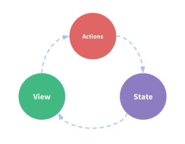
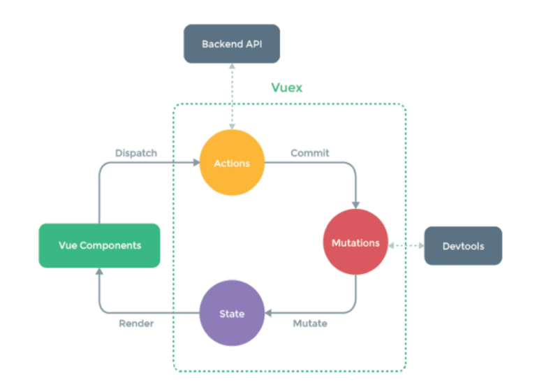

# Vuex

## Vuex

- 상태 관리 패턴 + 라이브러리
- 모든 컴포넌트에 대한 중앙 집중식 저장소 역할
- props-emit 컴포넌트끼리의 통신이 컴포넌트 개수가 많아지면 너무 복잡해짐

### state

- state는 곧 data 
  - 정적인 자료
- 애플리케이션 전반이 공유하고 있는 data
  - 애플리케이션의 핵심

### 상태 관리 패턴

- 공유된 상태를 추출하고 전역에서 관리하도록 함

### 기존  Pass props & Emit event

- 독립적인 컴포넌트들의 집합

  - 컴포넌트는 각자의 스코프를 가지고 있음
  - 공유하는 개념 자체가 없음

- 딱 한 계급 위에 부모 자식 관계끼리만 통신할 수 있음 props & emit

  - 데이터 흐름 직관적으로 파악 가능
    - 무조건 한 스텝 위/아래임을 보장하기 때문

- 동위 관계 컴포넌트끼리의 통신 불가

  - 중첩이 깊어지는 경우 동위 관계 컴포넌트로의 데이터 전달이 불편

- vue는 단방향 데이터 흐름을 기본적으로 가정하고 있음

  

  - state = data
  - view = HTML 화면
  - action = methods
  - data 바뀌면 화면이 바뀜 화면에서 input 등 인터랙션이 일어남(행동, 함수) 이에 따라 state가 바뀌는데 action을 통해 state가 바뀌게 됨

### Vuex management pattern

- 초월적 존재가 따로 있고 여기에서 모든 컴포넌트를 관리
- 중앙 상태 관리
  - 중앙 저장소에 state 즉 data(객체)를 모아놓고 관리
- 규모가 큰 (컴포넌트 중첩이 깊은) 프로젝트에서 효율적
- 각 컴포넌트에서는 중앙 집중 저장소의 state만 신경쓰면 됨
- 동일한 state를 공유하는 다른 컴포넌트들도 동기화 되어 알아서 반영이 됨

### 단방향 흐름에 의존한 state(상태) 관리

- 컴포넌트 관계가 단순하면 문제 없음
- 규모가 커지면 상태 관리가 어려움

### Vuex를 활용한 state(상태) 관리

- 중앙에 있는 데이터가 바뀌면 각 컴포넌트들이 알아서 움직여주길 바람
- 상태의 변화는 오로지 vuex가 관리해 상태를 공유하는 모든 컴포넌트는 변화에 반응
- 다른 컴포넌트는 신경 쓰지 않고 vuex에만 상태 변화를 알림

## Vuex Core Concepts

### Vuex 핵심 컨셉

​	

- 컴포넌트에서 상호작용이 일어나면 어떤 행동을 하게 됨
- action 함수, 모든 행동 
- mutation 함수 중 data의 변경을 일으키는 것
-  render 렌더링 화면이 바뀜 commit 저지르다 dispatch 호출하다 mutate 변경
- vuex가 담당하는 건 행동 - 변화 - 데이터 
  - 변화는 데이터의 변화

#### State

- data
- Vuex의 핵심
- single source of truth
  - 중앙에서 관리하는 데이터가 유일한 진실, 원본 소스
- 애플리케이션 하나마다 하나의 저장소만 갖게 됨
- Vuex Store에서 각 컴포넌트에서 사용하는 state 한 눈에 파악 가능
- state가 변경되면 관련있는 컴포넌트들은 알아서 변경
- Vuex Store에서 state 정보 가져와 사용

#### Mutations

- 실제로 state를 변경하는 유일한 방법
- Actions의 `commit()`에 의해 호출
  - 위험한 작업
- 비동기적 요소가 있으면 안 됨
  - state가 변화하는 시점이 언제일지 알 수 없어 추적할 수가 없기 때문
- 첫번째 인자로 항상 state를 받음

#### Actions

- mutations과 actions는 둘 다 함수
  - mutations의 기능을 제외한 나머지 함수가 actions
- 비동기 작업이 포함될 수 있음
- context 객체 인자를 받음
- 다 가능한 만능 함수 단, state 변경을 할 수 없음
  - state 변경은 mutations으로만 가능
    - 명확한 역할 분담을 위함
- 컴포넌트에서 `dispatch()`에 의해 호출

#### Getters

- state를 기반으로 추출해내는 값 getters
  - data를 기반으로 추출해내는 값 computed와 유사
- getters 자체는 state를 변경하지 않음 단지 추출해낸 값, 계산된 값을 가져오는 것

